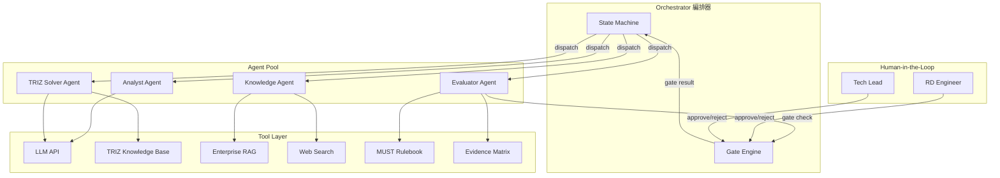
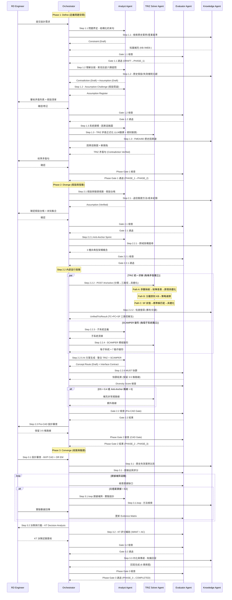

# AI Agent 架構設計：RD Design Copilot E2E 自動化

> **版本**：v1.4 | **日期**：2026-02-25
> **目的**：從 AI Agent 角度重新梳理 E2E 流程，定義自動化等級與多代理協作機制，重點解決 RD 路徑依賴問題。
> **對齊依據**：`RD_Design_Copilot_整合流程.md` v1.7 + `RD_Design_Copilot_State_Machine.md` v1.5
> **v1.2 更新**：TRIZ Solver Agent 升級為三路徑統一求解架構，反映已實作的 `triz_engine.py` 規則引擎 + `triz_solve_service.py` orchestrator + 5 個 Prompt 模板。
> **v1.3 更新**：Analyst Agent 新增假設推翻影響分析能力（`POST /assumptions/{id}/disprove` + `source_refs` 反查 + impact_analysis）。Step 2.1 R&R 新增 PDCA 迭代迴路（Step 2.2 → Step 2.1 回流）。未知集合 (U) 與假設透過 `assumption_refs` 結構化關聯。
> **v1.4 更新**：反映 Gap #3/#4/#5 已實作——(1) Anti-Anchor Sprint 端點 (`POST /alternatives/anti-anchor`)、(2) SCAMPER 新矛盾回饋迴路 (`POST /scamper/feedback-contradictions` + `new_contradictions`)、(3) 子系統智慧建議 (`GET /scamper/subsystem-suggestions`)。TRIZ Solver Agent 工具綁定新增 `scamper_contradiction_feedback` 和 `subsystem_suggester`。

---

## §1 Multi-Agent 架構總覽

### 1.1 Agent 角色定義

| Agent | 職責 | 核心能力 | 綁定工具 |
|-------|------|---------|---------|
| **Analyst Agent** | 需求解構、索克拉底問答、因果迴路建模、矛盾識別、假設質疑、**假設推翻影響分析 (PDCA)**、**假設批次萃取** | 語意理解、結構化拆解、隱含假設偵測、**source_refs 反查受影響工件**、**impact_analysis + recommended_actions 生成** | LLM、Prompt Template、Functional Model Generator、**Assumption Disprove API** |
| **TRIZ Solver Agent** | AutoTRIZ 三路徑統一求解 (`POST /triz/solve`) + SCAMPER 變形 + **新矛盾回饋** (`POST /scamper/feedback-contradictions`) + **子系統建議** (`GET /scamper/subsystem-suggestions`) | 矛盾分類 (LLM)、參數映射 (LLM+KB)、矩陣查表 (規則引擎)、分離原則注入、76 標準解匹配、原理具體化 (LLM+KB)、**SCAMPER→矛盾閉環回饋**、**子系統規則提取 (零 LLM)** | `triz_engine.py` (規則引擎)、`triz_solve_service.py` (orchestrator)、5 Prompt Templates、LLM、RAG |
| **Evaluator Agent** | MUST 規則驗證、KT 決策分析、證據品質評分、Gate 判定 | 規則引擎、加權評分、風險評估 | MUST Rulebook、Evidence Matrix、Risk Register、LLM |
| **Knowledge Agent** | 企業 RAG 檢索、Web 文獻搜尋、跨域類比、知識回寫 | 向量檢索、Web Scraping、文件分類、Citation 生成 | Vector DB、Web Search API、Document Store |

### 1.2 Orchestrator（編排器）

- 負責 Step 流轉、Gate 判定、Agent 調度
- 維護 Process State Machine（對接現有雙層狀態機）
- 管理 Artifact 版本狀態（Draft → Reviewed → Verified → Baselined → Released）

### 1.3 架構圖



---

## §2 逐步自動化分級

### 2.1 自動化等級定義

| 等級 | 說明 | AI 角色 | 人類角色 |
|------|------|---------|---------|
| **Fully Auto** | AI 獨立完成，人類僅在最終選擇時介入 | 執行者 | 選擇者 |
| **AI-Driven** | AI 主導產出，人類審核確認 | 主導者 | 審核者 |
| **AI-Assisted** | 人類主導決策，AI 提供分析與建議 | 顧問 | 決策者 |
| **Human-Led** | 人類主導，AI 僅做格式化或紀錄 | 記錄者 | 主導者 |

### 2.2 E2E 步驟自動化對照表

> 步驟名稱與編號完全對齊 `RD_Design_Copilot_State_Machine.md` Step 編號對照表。

| Step | 正式名稱 | Phase | 自動化等級 | 主要 Agent | 人類角色 | 路徑依賴風險 | 核心工件 |
|------|---------|-------|-----------|-----------|---------|-------------|---------|
| **1.1** | **問題界定** (白帽 + 5W1H) | 1 | AI-Assisted | Analyst + Knowledge | 提供原始需求、確認約束句 | 低 | Constraint |
| **1.2** | **理解全貌** (索克拉底問答) | 1 | **AI-Driven** | Analyst + Knowledge | 參與問答、確認假設與矛盾 | **高** — 慣用架構偏見 | Contradiction, Assumption |
| **1.3** | **系統建模** (因果迴路 + TRIZ 矛盾 + 斷路點) | 1 | **AI-Driven** | Analyst + TRIZ Solver | 校準矛盾句、確認斷路點 | **高** — 傾向忽略矛盾 | Contradiction, Breakpoint |
| **2.1** | **假設與驗證規劃** (HDA + 未知集合 + **PDCA 閉環**) | 2 | **AI-Driven** | Analyst + Knowledge | 填寫假設台帳、定義未知集合、**對 Disproved 假設做處置決策** | 中 | Assumption |
| **2.2.1** | **Anti-Anchor Sprint** (反路徑依賴, `POST /alternatives/anti-anchor`) | 2 | **Fully Auto** | Analyst + Knowledge | 審核非典型架構 | **最高** — Anti-Anchor 核心 | Alternative (status=anti_anchor) |
| **2.2.2** | **TRIZ 統一求解** (分類→三路徑路由→具體化, `POST /triz/solve`) | 2 | **Fully Auto** | TRIZ Solver + Knowledge | 僅選擇 | **高** — 解法錨定 | Concept Route (部分) |
| **2.2.3** | **子系統定義** (受影響子系統識別, `GET /scamper/subsystem-suggestions`) | 2 | AI-Driven | Analyst + TRIZ Solver | 從建議清單選取或自訂 | 中 | Concept Route (部分) |
| **2.2.4** | **SCAMPER 模組變形** (每子系統 × 7 動作 + `new_contradictions` 回饋) | 2 | **Fully Auto** | TRIZ Solver + Knowledge | 僅選擇 | 高 — 變形慣性 | Concept Route (部分), Contradiction (回饋) |
| **2.2.5** | **AI 方案生成** (整合 TRIZ + SCAMPER) | 2 | **AI-Driven** | Analyst + TRIZ Solver | 審核方案規格 | 中 | Concept Route, Interface |
| **2.2.6** | **MUST 快篩** (Go/No-Go 淘汰) | 2 | **AI-Driven** | Evaluator | 確認 MUST 判定結果 | 低 | Concept Route |
| **2.3** | **Pre-CAD 設計審查** (Pre-CAD Gate) | 2 | **AI-Driven** | Evaluator | 審核 Gate 2.2 結果、決策保留路線 | 低 | Pre-CAD Review Report |
| **3.1** | **設計審查** (CAD Gate - MVP CAD Review) | 3 | AI-Assisted | Evaluator + Knowledge | 繪製 MVP CAD、填寫 DR EM、黑帽質疑 | 低 | Evidence Matrix, Risk, MVP CAD Model |
| **3.1.loop** | **證據補齊** (Evidence Closure) | 3 | AI-Assisted | Knowledge + Evaluator | 設計/執行最小實驗、收集證據 | 低 | Evidence |
| **3.2** | **決策與行動** (KT Decision Analysis + 最小實驗) | 3 | Human-Led | Evaluator | 執行 KT 決策 (MUST→WANT→AC)、簽核 | 低 | Decision Record |
| **3.3** | **內化與傳達** (費曼) | 3 | **Fully Auto** | Knowledge | 無需介入（知識回寫自動化） | 無 | Asset |

### 2.3 與 State Machine R&R 對照

| Step | State Machine 中的 Human R&R | State Machine 中的 AI R&R | Agent 映射 |
|------|---------------------------|-------------------------|-----------|
| 1.1 | 定義 Mission / Hard Constraints / Soft Objectives | 改寫約束句、生成缺口問卷 | Analyst Agent |
| 1.2 | 參與索克拉底問答、識別矛盾 | 固定執行六類提問、匯總矛盾列表 | Analyst Agent |
| 1.3 | 輔助因果迴路圖、正式化矛盾句 | 協助繪製因果迴路、提供 TRIZ 模板 | Analyst + TRIZ Solver |
| 2.1 | 填寫假設台帳、定義未知集合、**對 Disproved 假設做處置決策** | 提供模板、整理未知因子、**假設推翻影響分析 (disprove + source_refs 反查 → impact_analysis)**、**批次萃取假設 (extract)** | Analyst + Knowledge |
| 2.2 | 定義子系統（從建議選取或自訂）、審查方案、執行 MUST | Anti-Anchor (`POST /alternatives/anti-anchor`) / TRIZ / SCAMPER (含 `new_contradictions` 回饋 `POST /scamper/feedback-contradictions`) / 子系統建議 (`GET /scamper/subsystem-suggestions`) / 方案生成 / MUST 快篩 | TRIZ Solver + Analyst + Evaluator |
| 2.3 | 依 Pre-CAD 模板審查、決策保留路線 | 提供模板、匯總審查結果 | Evaluator |
| 3.1 | 繪製 MVP CAD、填 DR EM、黑帽質疑 | 提供模板、失效案例比對 | Evaluator + Knowledge |
| 3.1.loop | 設計/執行最小實驗 | 協助實驗設計、歸檔證據 | Knowledge |
| 3.2 | KT 決策 (WANT 評分 + AC)、簽核 | 提供 KT 模板、整理風險矩陣 | Evaluator |
| 3.3 | 製作摘要、編寫 FAQ | 知識沉澱為可重用資產 | Knowledge |

---

## §3 打破路徑依賴的 AI 機制

### 3.1 問題定義

RD 路徑依賴的典型表現：

| 症狀 | 描述 | 影響的 Step |
|------|------|-----------|
| **慣用架構偏見** | 直接套用過去成功方案的架構 | Step 1.2 理解全貌 |
| **矛盾盲視** | 忽略或低估技術矛盾，跳過 TRIZ | Step 1.3 系統建模 |
| **錨定效應** | 第一個想到的方案成為基準，後續方案僅為微調 | Step 2.2.1 / 2.2.2 / 2.2.4 |
| **隱含假設** | 將假設當作事實，未質疑技術前提 | Step 1.2-2.1 |
| **經驗慣性** | 只搜尋熟悉領域的解法，忽略跨域靈感 | Step 2.2.2 / 2.2.4 |

### 3.2 AI 對抗機制

#### 機制 1：Assumption Challenge（假設質疑）
- **觸發點**：Step 1.2 索克拉底問答過程中
- **執行者**：Analyst Agent
- **對齊**：整合流程 §Step 1.2 六類提問中的「假設」與「反思」類
- **作法**：
  1. 從索克拉底問答中提取所有隱含假設（如「必須用齒輪傳動」）
  2. 對每個假設提出反問：「如果不用 X，還有什麼替代方案？」
  3. 產出 Assumption Register，標記 `challenged` / `confirmed`
- **產出物**：Assumption 工件（Draft），供 Step 2.1 假設台帳引用

#### 機制 2：Forced Divergence（強制發散）
- **觸發點**：Step 2.2.1 Anti-Anchor Sprint + Step 2.2.2 TRIZ 解矛盾
- **執行者**：TRIZ Solver Agent + Analyst Agent
- **對齊**：整合流程 §5.1 Anti-Anchor Sprint 規則
- **作法**：
  1. Step 2.2.1 產出 3 種「非典型架構」概念（整合流程原文規則）
  2. Step 2.2.2 每個矛盾至少產出 3 條工程對映
  3. 至少 1 條必須是「跟競品在物理介面或核心機制上不相容」的路線
- **閾值**：Gate 2.2.1 — 三條概念路線中至少一條非對標且初步通過 M1 + M4

#### 機制 3：Cross-Domain Analogical Search（跨域類比搜尋）
- **觸發點**：Step 2.2.2 / 2.2.4 並行執行期間
- **執行者**：Knowledge Agent
- **作法**：
  1. 將核心矛盾抽象為功能語言（如「在有限空間內散熱」→「受限空間的能量轉移」）
  2. 搜尋異業專利與論文（醫療器材、航太、消費電子）
  3. 將異業解法翻譯回 eBike 領域語言
- **產出物**：≥2 條跨域類比方案，附 citation（KB-/WEB- 格式）

#### 機制 4：Anti-Anchor Gate（反錨定閘門）
- **觸發點**：Step 2.2.1 → Step 2.2.2 之間（對齊 State Machine 的 Gate 2.2.1）
- **執行者**：Evaluator Agent
- **對齊**：整合流程 §5.1 Anti-Anchor Gate 檢查點
- **作法**：
  1. 檢查三條概念路線是否有至少一條「非對標」
  2. 非對標路線須初步通過 M1（空間約束）和 M4（解耦程度）
  3. 不通過 → 回退 Step 2.2.1 重新發散

#### 機制 5：Diversity Score 指標
- **觸發點**：Step 2.2.6 MUST 快篩後、進入 Gate 2.2 前
- **執行者**：Evaluator Agent
- **定義**：基於候選方案的功能結構向量，計算成對餘弦距離的平均值
- **公式**：`DS = mean(1 - cos_sim(route_i, route_j))` for all i ≠ j
- **門檻**：DS ≥ 0.4 且保留路線 ≥ 3 條（含 ≥1 條 Anti-Anchor）才能進入 Gate 2.2

---

## §4 Agent 間協作流程

### 4.1 主流程序列圖



### 4.2 並行處理規則

> 對齊 State Machine §平行處理說明：「不同矛盾句的 TRIZ 解法、不同子系統的 SCAMPER 變形可並行執行」。

| 可並行的組合 | 前置條件 | 說明 |
|-------------|---------|------|
| 不同矛盾句的 2.2.2 (TRIZ 統一求解) | Gate 2.1 通過 + Gate 2.2.1 通過 | 每條矛盾獨立呼叫 `POST /triz/solve`，內部自動完成分類→三路徑→具體化 |
| 不同子系統的 2.2.4 (SCAMPER 變形) | 2.2.3 子系統清單已定義 | 每個子系統獨立變形 |
| 2.2.2 (TRIZ) 與 2.2.3→2.2.4 (子系統→SCAMPER) | Gate 2.2.1 通過 | TRIZ 和 SCAMPER 為互補路徑 |
| Knowledge Agent 預檢索 + 主流程 | 任何 Step | Knowledge Agent 可提前快取 |

> **注意**：每條矛盾的統一求解 (`POST /triz/solve`) 是原子操作——一次呼叫自動完成分類(LLM) → 三路徑路由(TC/PC/SF) → 規則引擎查表 → LLM 具體化，每次最多 4 個 LLM calls。2.2.3（子系統定義）依賴 2.2.2 的解法方向指出受影響子系統，但不同矛盾的 2.2.2 可與不同子系統的 2.2.4 並行。所有並行產出匯聚到 2.2.5 (AI 方案生成) 做交叉組合，再由 2.2.6 (MUST 快篩) 統一淘汰。

### 4.3 Gate 自動化判定

> 對齊 State Machine §Gate 與 Phase 轉換對照表，完整列出所有 Gate。

| Gate | 位置 | Gate 類型 | Phase 轉換 | 可否自動 | 判定邏輯 | Fallback |
|------|------|-----------|-----------|---------|---------|---------|
| **Gate 1.1** | Step 1.1 → Step 1.2 | 內部 Gate | **DRAFT → PHASE_1** | AI-Driven | 三個最不能失敗指標已明確且可量測 | 人類覆審 |
| **Gate 1.2** | Step 1.2 → Step 1.3 | 內部 Gate | Phase 1 內部 | AI-Driven | ≥10 條假設 + Top 3 致命假設 + ≥3 條核心矛盾 | 人類覆審 |
| **Phase Gate 1** | Step 1.3 → Step 2.1 | Phase Gate | **PHASE_1 → PHASE_2** | AI-Driven | ≥1 因果迴路 + ≥3 斷路點 + 每條矛盾有 TRIZ 正式句 | 人類覆審 |
| **Gate 2.1** | Step 2.1 → Step 2.2 | 內部 Gate | Phase 2 內部 | AI-Driven | Top 3 假設每個有 1-2 週內可完成的驗證設計 | 人類覆審 |
| **Gate 2.2.1** | Step 2.2.1 → Step 2.2.2 | 內部 Gate | Phase 2 內部 | **Fully Auto** | ≥1 非對標路線且初步通過 M1 + M4 | 自動回退 2.2.1 |
| **Gate 2.2** | Step 2.2 → Step 2.3 | **Pre-CAD Gate** | Phase 2 內部 | AI-Driven | ≥3 條架構級路線 + ≥1 Anti-Anchor + 每條有完整方案規格 + DS ≥ 0.4 | 人類覆審 |
| **Phase Gate 2** | Step 2.3 → Step 3.1 | **CAD Gate** | **PHASE_2 → PHASE_3** | Human-Led | 候選收斂至 3-5 條 + Interface Contract 已更新 + 最小 CAD 範圍明確 | N/A |
| **Gate 3.1** | Step 3.1 → Step 3.1.loop | 內部 Gate | Phase 3 內部 | AI-Driven | 北極星指標證據 ≥ E2，否則進入 3.1.loop 迴圈 | 人類覆審 |
| **Gate 3.2** | Step 3.2 → Step 3.3 | 內部 Gate | Phase 3 內部 | Human-Led | KT 決策記錄完整已簽核 + 所有 H 風險有緩解 | N/A |
| **Phase Gate 3** | Step 3.3 → Done | Phase Gate | **PHASE_3 → COMPLETED** | AI-Driven | 所有核心工件 Baselined → Released | 人類覆審 |

### 4.4 Artifact State 轉換（對齊 State Machine）

| Step | 核心工件 | 狀態轉換 |
|------|---------|---------|
| Step 1.1 → Gate 1.1 | Constraint | Draft → Reviewed |
| Step 1.2 → Gate 1.2 | Contradiction, Assumption | Draft → Reviewed |
| Step 1.3 → Phase Gate 1 | Contradiction | Reviewed → Verified |
| Step 1.3 → Phase Gate 1 | Breakpoint | Draft → Reviewed |
| Step 2.1 → Gate 2.1 | Assumption | Reviewed → Verified |
| Step 2.2.6 → Gate 2.2 | Concept Route, Interface | Draft → Reviewed |
| Step 2.3 → Phase Gate 2 | Concept Route | Reviewed → Verified |
| Step 2.3 → Phase Gate 2 | Pre-CAD Review Report | Draft → Reviewed |
| Step 3.1 → Gate 3.1 | Evidence Matrix, Risk | Draft → Reviewed |
| Step 3.1 → Phase Gate 2 | MVP CAD Model | Draft → Reviewed |
| Step 3.2 → Gate 3.2 | Concept Route | Verified → Baselined |
| Step 3.2 → Gate 3.2 | Decision Record | Draft → Reviewed |
| Step 3.3 → Phase Gate 3 | All Core Artifacts | Baselined → Released |

---

## §5 打破路徑依賴的 AI 機制（詳細設計）

### 5.1 路徑依賴風險熱力圖

```
Step:   1.1   1.2   1.3   2.1  2.2.1 2.2.2 2.2.3 2.2.4 2.2.5 2.2.6  2.3   3.1  3.1.loop 3.2   3.3
Risk:   🟢   🔴   🔴   🟡   🔴   🔴   🟡   🟡   🟡   🟢   🟢   🟢   🟢   🟢   ⚪
AI介入: ◐    ●    ●    ◐    ●    ●    ●    ●    ●    ●    ●    ◐    ◐    ○    ●

圖例：🔴 高風險  🟡 中風險  🟢 低風險  ⚪ 無風險
      ● Fully Auto / AI-Driven  ◐ AI-Assisted  ○ Human-Led
```

> **設計原則**：路徑依賴風險越高的步驟，AI 介入程度越深。正是因為人類在 Step 1.2（慣用架構）、Step 1.3（矛盾盲視）、Step 2.2.1/2.2.2（錨定效應）最容易陷入慣性，才需要 AI 強制介入打破錨定。

### 5.2 機制與 Step 對應表

| AI 機制 | 觸發 Step | Agent | 對齊整合流程章節 |
|---------|----------|-------|----------------|
| Assumption Challenge | Step 1.2 | Analyst | §Step 1.2 索克拉底六類提問 |
| Forced Divergence | Step 2.2.1 + 2.2.2 | TRIZ Solver + Analyst | §5.1 Anti-Anchor Sprint + §2.2.2 TRIZ 解矛盾 |
| Cross-Domain Search | Step 2.2.2/2.2.4 並行 | Knowledge | §5.0 知識增強輸入 (Web 外部專利/新材料) |
| Anti-Anchor Gate | Step 2.2.1 → 2.2.2 | Evaluator | §5.1 Anti-Anchor Gate 檢查點 |
| Diversity Score | Step 2.2.6 → Gate 2.2 | Evaluator | §Gate 2.2 檢查點 (≥3 路線 + ≥1 Anti-Anchor) |

---

## §6 技術實作建議

### 6.1 推薦框架：LangGraph

選擇理由：
- 原生支援有狀態的多 Agent 圖（State Graph）
- 與現有雙層狀態機設計高度吻合
- 支援條件分支、並行節點、人類介入節點（`interrupt_before` / `interrupt_after`）
- Python 生態，可直接對接 FastAPI 後端

### 6.2 Agent-Tool 綁定

```yaml
analyst_agent:
  llm: claude-sonnet-4-6
  tools:
    - functional_model_generator  # Step 1.3 產出因果迴路圖 + 功能樹
    - assumption_extractor        # Step 1.2 假設質疑 + Step 2.1 批次萃取
    - assumption_disprove_analyzer # Step 2.1 假設推翻影響分析 (POST /assumptions/{id}/disprove)
    - scamper_checklist           # Step 2.2.4 SCAMPER 模板 (交由 TRIZ Solver 執行)
    - anti_anchor_generator       # Step 2.2.1 非典型架構生成
  prompts:
    - system: "你是一位機械工程系統分析師..."

triz_solver_agent:
  llm: claude-sonnet-4-6
  services:
    - triz_engine              # 規則引擎 (src/services/triz_engine.py)
      # 啟動時解析 5 個 KB markdown → in-memory 資料結構
      # API: lookup_matrix(), get_principles(), get_standards_for_state()
      #       format_params_for_prompt(), format_principles_for_prompt()
      #       format_separations_for_prompt(), format_standards_for_prompt()
    - triz_solve_service       # 求解 orchestrator (src/services/triz_solve_service.py)
      # API: solve(contradiction, constraints, db) → UnifiedTrizResult
      # 內部流程: _classify() → _map_params() → _solve_technical/physical/sufield()
  prompts:
    - triz_classify.md         # Step 2.2.2-0 矛盾分類 (TC/PC/SF)
    - triz_param_mapping.md    # Step 2.2.2-A1 自然語言 → 39 參數 ID
    - triz_tc_solve.md         # Step 2.2.2-A4 技術矛盾具體化 (注入矩陣結果+原理詳情)
    - triz_pc_solve.md         # Step 2.2.2-B1 物理矛盾分離策略 (注入 4 大分離原則)
    - triz_sf_solve.md         # Step 2.2.2-C2 Su-Field 具體化 (注入匹配的標準解)
    - scamper_variant.md       # Step 2.2.4 SCAMPER 模組變形 (含 new_contradictions 輸出)
    - anti_anchor_sprint.md    # Step 2.2.1 Anti-Anchor Sprint (3 非典型架構)
  tools:
    - scamper_contradiction_feedback  # POST /scamper/feedback-contradictions (SCAMPER→矛盾閉環)
    - subsystem_suggester             # GET /scamper/subsystem-suggestions (斷路點+TRIZ→子系統建議)
  knowledge_base:              # 由 triz_engine 解析為 in-memory 結構
    - triz_knowledge_base/01_39_parameters.md      # 39 params → TrizParam dataclass
    - triz_knowledge_base/02_contradiction_matrix.md # 39×39 sparse → dict[(int,int), list[int]]
    - triz_knowledge_base/03_40_principles.md       # 40 principles → TrizPrinciple dataclass
    - triz_knowledge_base/04_separation_principles.md # 4 types → SeparationPrinciple dataclass
    - triz_knowledge_base/05_76_standard_solutions.md # 76 standards → StandardSolution dataclass
  db_models:
    - TrizSolution             # Path A 技術矛盾解法
    - SeparationSolution       # Path B 物理矛盾解法
    - SuFieldSolution          # Path C Su-Field 解法

evaluator_agent:
  llm: claude-sonnet-4-6
  tools:
    - must_rule_checker           # Step 2.2.6 MUST 快篩
    - kt_scorer                   # Step 3.2 KT 加權評分 (WANT + AC)
    - evidence_quality_assessor   # Step 3.1 E-level 評估
    - diversity_score_calculator  # Gate 2.2 前方案多樣性
    - pre_cad_reviewer            # Step 2.3 5 維度審查
    - anti_anchor_gate_checker    # Step 2.2.1→2.2.2 反錨定檢查
  templates:
    - MUST_Rulebook_Template.md
    - Pre_CAD_Review_Template.md
    - Evidence_Matrix_Risk_Register_Template.md

knowledge_agent:
  llm: claude-haiku-4-5  # 快速檢索用輕量模型
  tools:
    - enterprise_rag_search       # 企業知識庫 (FMEA/8D/決策/規範)
    - web_patent_search           # 專利搜尋 (Google Patents / Espacenet)
    - web_literature_search       # 論文搜尋
    - cross_domain_translator     # 異業→本業翻譯
    - knowledge_writeback         # Step 3.3 回寫知識庫 (6 類資產)
  citation_format:
    rag: "KB-{領域}-{序號}"       # e.g., KB-FMEA-042
    web: "WEB-{類型}-{序號}"      # e.g., WEB-PAT-003
```

### 6.3 State Management 對接

```yaml
process_states:
  # 對應 State Machine 的 Process State
  - DRAFT → PHASE_1 → PHASE_2 → PHASE_3 → COMPLETED
  # Step-level
  - IDLE → STEP_1.1_ACTIVE → STEP_1.2_ACTIVE → STEP_1.3_ACTIVE
    → STEP_2.1_ACTIVE → STEP_2.2_ACTIVE (含 2.2.1/2.2.2/2.2.3/2.2.4/2.2.5/2.2.6)
    → STEP_2.3_ACTIVE → STEP_3.1_ACTIVE → STEP_3.1.LOOP_ACTIVE (迴圈)
    → STEP_3.2_ACTIVE → STEP_3.3_ACTIVE → COMPLETED

artifact_states:
  # 對應 State Machine 的 Artifact State
  - Draft → Reviewed → Verified → Baselined → Released

agent_state:
  - idle → running → waiting_human → completed → error

orchestrator_state:
  current_step: "step_2.2.2"
  current_phase: "PHASE_2"
  parallel_tasks: ["triz_c001", "triz_c002", "scamper_subsys_a"]
  gate_results:
    gate_1.1: "passed"
    gate_1.2: "passed"
    phase_gate_1: "passed"
    gate_2.1: "passed"
    gate_2.2.1: "passed"
    gate_2.2: "pending"
  human_pending: []
  artifact_versions:
    constraint: "reviewed"
    contradiction: "verified"
    assumption: "verified"
    concept_route: "draft"
```

---

## §7 驗證方式

### 7.1 E2E 驗證場景：eBike 馬達散熱

1. **輸入**：「eBike 中置馬達在長坡連續高負載下溫度超標，需在 150×80mm 空間內解決」
2. **預期結果**：
   - Step 1.1：Constraint (Draft) 含三個最不能失敗指標，Gate 1.1 通過
   - Step 1.2：索克拉底問答產出 ≥10 假設 + ≥3 矛盾，Assumption Challenge 至少質疑「必須用風冷」
   - Step 1.3：因果迴路圖含熱-機-振耦合，TRIZ 矛盾句正式化（改善散熱 vs 惡化空間）
   - Step 2.2.1：3 種非典型架構，≥1 條非對標（如磁力傳動），Gate 2.2.1 通過
   - Step 2.2.2：每條矛盾 ≥3 條 TRIZ 工程對映，含 ≥1 條非風冷方案（相變材料、液冷、熱管）
   - Step 2.2.4：SCAMPER 對散熱子系統 × 7 動作變形
   - Step 2.2.6：MUST 快篩後保留 3-5 條，Diversity Score ≥ 0.4
   - Step 2.3：Pre-CAD 審查收斂至 3-5 條
   - Step 3.3：散熱方案知識回寫至企業知識庫（6 類資產）

### 7.2 檢查清單

- [ ] 每個 Step 名稱與 `RD_Design_Copilot_State_Machine.md` Step 編號對照表完全一致
- [ ] 每個 Gate 的判定邏輯與 `整合流程.md` Gate 檢查點一致
- [ ] Artifact State 轉換與 State Machine §Gate 與 Phase 轉換對照表一致
- [ ] Step 2.2 內部子步驟（2.2.1/2.2.2/2.2.3/2.2.4/2.2.5/2.2.6）順序與整合流程 §5.2 流程架構圖一致
- [ ] 並行規則與 State Machine §平行處理說明一致（TRIZ 與 SCAMPER 並行，非 2.2.2+2.2.3+2.2.4 全並行）
- [ ] MUST 規則 (M1-M6) 與 MUST_Rulebook_Template.md 一致
- [ ] Pre-CAD 審查 5 維度與 Pre_CAD_Review_Template.md 一致
- [ ] Knowledge Agent 的 citation 格式（KB-/WEB-）與整合流程 §1.4 知識引用規範一致
- [ ] AutoTRIZ 統一求解子步驟（2.2.2-0 分類, 2.2.2-A1~A4 技術矛盾, 2.2.2-B1 物理矛盾, 2.2.2-C1~C2 Su-Field）與整合流程 §2.2.2 AutoTRIZ 執行模式表一致
- [ ] KT 決策在 Step 3.2（非 Step 2.2.6），MUST 快篩在 Step 2.2.6（非 Step 3.2）

---

## 附錄 A：與現有文件的對應關係

| 本文件章節 | 對應的 E2E 文件 | 對應章節 |
|-----------|----------------|---------|
| §1 Agent 定義 | PRD_RD_Design_Copilot.md | §AI 角色邊界表 |
| §2.2 自動化對照表 | RD_Design_Copilot_State_Machine.md | §Step 編號對照 + §R&R |
| §2.3 R&R 對照 | RD_Design_Copilot_State_Machine.md | §各 Step R&R |
| §3 路徑依賴機制 | PRD_RD_Design_Copilot.md | §Pain Points |
| §4.1 序列圖 | RD_Design_Copilot_整合流程.md | §流程總覽 + 各 Step |
| §4.2 並行規則 | RD_Design_Copilot_State_Machine.md | §平行處理說明 |
| §4.3 Gate 判定 | 整合流程.md + State_Machine.md | §Gate 與 Phase 轉換對照 |
| §4.4 Artifact 轉換 | RD_Design_Copilot_State_Machine.md | §Gate 關鍵工件狀態轉換 |
| §5.2 機制對應 | RD_Design_Copilot_整合流程.md | §5.1 Anti-Anchor + §2.2.2 TRIZ |
| §6.2 TRIZ KB | triz_knowledge_base/README.md | §注入策略 |
| §6.3 State Management | RD_Design_Copilot_State_Machine.md | §雙層狀態機 |
| §7.2 MUST 驗證 | MUST_Rulebook_Template.md | 全文 |
| §7.2 Pre-CAD 驗證 | Pre_CAD_Review_Template.md | 全文 |
| §7.2 Evidence 驗證 | Evidence_Matrix_Risk_Register_Template.md | 全文 |
