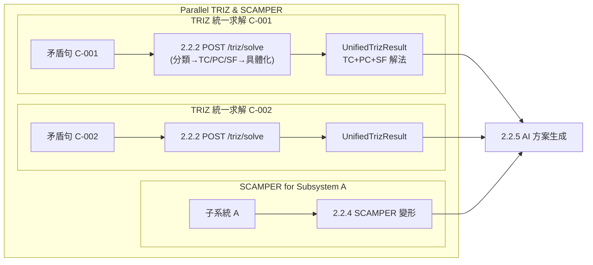

# RD Design Copilot 整合流程狀態機與 R&R (E2E)

本文件以程式設計角度繪製 `RD Design Copilot 整合流程 (E2E)` 的狀態機圖，並說明每個階段的 Roles & Responsibilities (R&R)。
本文件核心概念為 **雙層狀態機 (Dual-Layer State Machine)**，同時管理 **流程狀態 (Process State)** 與 **工件狀態 (Artifact State)**。

> **v1.2 更新**：Step 編號已按實際執行順序重新編排，引入雙層狀態機概念，並加入 `Step 3.1.loop: 證據補齊 (Evidence Closure)` 迴圈。
> **v1.3 更新**：Step 2.2.2 TRIZ 解矛盾升級為三路徑統一求解（`POST /triz/solve`），分類(LLM) → TC/PC/SF 路由 → 規則引擎查表 + LLM 具體化，回傳 `UnifiedTrizResult`。
> **v1.4 更新**：新增 Step 2.1 ↔ Step 2.2 假設推翻迭代迴路。Step 2.1 AI R&R 新增「假設推翻影響分析」（`POST /assumptions/{id}/disprove`）。Gate 2.1 檢查點新增 Disproved 假設處置要求。未知集合 (U) 與假設透過 `assumption_refs` 結構化關聯。
> **v1.5 更新**：Step 2.2 AI R&R 新增三項已實作能力：(1) Anti-Anchor Sprint 端點 (`POST /alternatives/anti-anchor`)，(2) SCAMPER 新矛盾回饋迴路 (`POST /scamper/feedback-contradictions` + `new_contradictions` 欄位)，(3) 子系統智慧建議 (`GET /scamper/subsystem-suggestions`，從斷路點+TRIZ 解法自動提取)。
> **v1.6 更新**：8-Gate 系統完整實作（gate_id 從整數改為字串 "1.1"-"3.3"，共 8 個 checker）。Step 2.3 Pre-CAD Review 已實作（`PreCadReview` model，5 維度評分 space/cost/safety/decoupling/supply 各 1-5 分 + AI 分析端點）。Step 3.1 證據矩陣已實作（`Experiment.evidence_level` E0-E4 + `GET /experiments/evidence-matrix` 聚合端點）。Step 3.2 WANT 標準模板已實作（`POST /want/criteria/seed` 建立 W1-W6 標準條件）。Gate 判定邏輯已更新，反映各 Gate 的實際 checker 規則。

## Step 編號對照

| 新編號 | 名稱 | Phase | 核心工件類型 |
|--------|------|-------|------------|
| Step 1.1 | 問題界定 | 1 | Constraint |
| Step 1.2 | 理解全貌（索克拉底） | 1 | Contradiction, Assumption |
| Step 1.3 | 系統建模（因果迴路+TRIZ矛盾+斷路點） | 1 | Contradiction, Breakpoint |
| Step 2.1 | 假設與驗證規劃（HDA+未知集合） | 2 | Assumption |
| **Step 2.2** | **創造與調整（TRIZ解矛盾→子系統定義→SCAMPER變形→方案集合→MUST快篩）** | **2** | Concept Route, Interface |
| **Step 2.3** | **Pre-CAD 設計審查 (Pre-CAD Gate)** | **2** | Pre-CAD Review Report |
| **Step 3.1** | **設計審查 (CAD Gate - MVP CAD Review)** | **3** | Concept Route, Evidence Matrix, Risk |
| Step 3.1.loop | 證據補齊 (Evidence Closure) | 3 | Evidence |
| Step 3.2 | 決策與行動（KT Decision Analysis+最小實驗） | 3 | Concept Route, Decision Record, Evidence |
| Step 3.3 | 內化與傳達（費曼） | 3 | Asset |

## 核心流程狀態機 (Process State Machine)

```mermaid
graph LR
    subgraph Phase1["Phase 1: Define"]
        S1_1["Step 1.1<br>問題界定"] -->|"Gate 1.1"| S1_2["Step 1.2<br>理解全貌"]
        S1_2 -->|"Gate 1.2"| S1_3["Step 1.3<br>系統建模"]
    end

    subgraph Phase2["Phase 2: Diverge"]
        S2_1["Step 2.1<br>假設與驗證規劃"]
        subgraph S2_2["Step 2.2: 創造與調整"]
            S2_2_1["2.2.1 Anti-Anchor"] -->|"Gate 2.2.1"| S2_2_2["2.2.2 TRIZ 統一求解"]
            S2_2_2 --> S2_2_3["2.2.3 子系統定義"]
            S2_2_3 --> S2_2_4["2.2.4 SCAMPER 變形"]
            S2_2_2 --> S2_2_5["2.2.5 AI 方案生成"]
            S2_2_4 --> S2_2_5
            S2_2_5 --> S2_2_6["2.2.6 MUST 快篩"]
        end
        S2_1 -->|"Gate 2.1"| S2_2_1
        S2_2_6 -.->|"假設推翻 PDCA"| S2_1
        S2_2_6 -->|"Gate 2.2"| S2_3["Step 2.3<br>Pre-CAD 審查"]
    end

    subgraph Phase3["Phase 3: Converge"]
        S3_1["Step 3.1<br>設計審查+證據矩陣"]
        S3_1_loop["Step 3.1.loop<br>證據補齊"]
        S3_2["Step 3.2<br>決策與行動"]
        S3_3["Step 3.3<br>內化與傳達"]
        S3_1 -.->|"證據缺口"| S3_1_loop
        S3_1_loop -.->|"證據更新"| S3_1
        S3_1 -->|"證據充足"| S3_2
        S3_2 -->|"Gate 3.2"| S3_3
    end

    S1_3 ==>|"Phase Gate 1<br>Gate 1.3"| S2_1
    S2_3 ==>|"Phase Gate 2<br>Gate 2.3"| S3_1
    S3_3 ==>|"Phase Gate 3<br>Gate 3.3"| Done(("COMPLETED"))
```

## Gate 與 Phase 轉換對照 (更新)

系統有 8 個 Step-level Gate（每步一個），其中 4 個同時觸發 Phase 轉換：

| Gate | 位置 | Gate 類型 | Phase 轉換？ | 已實作 Checker 邏輯 (`POST /gates/{gate_id}/check`) | 關鍵工件狀態轉換 |
|------|------|-----------|-------------|-----------------------------------------------------|---------------------|
| Gate 1.1 | Step 1.1 → Step 1.2 | 內部 Gate | **DRAFT → PHASE_1** | `check_gate_1_1`: TaskDefinition 存在 + mission 已填 + ≥3 critical_metrics 且每個有 method | Constraint: Draft → Reviewed |
| Gate 1.2 | Step 1.2 → Step 1.3 | 內部 Gate | Phase 1 內部 | `check_gate_1_2`: ≥10 Assumption + ≥3 High/Medium-High 風險假設 + ≥3 Contradiction | Contradiction, Assumption: Draft → Reviewed |
| Phase Gate 1 (= Gate 1.3) | Step 1.3 → Step 2.1 | 內部 Gate | **PHASE_1 → PHASE_2** | `check_gate_1_3`: ≥1 CausalLoop + ≥3 Breakpoint + 所有 Contradiction 已分類 (contradiction_types 非空) | Contradiction: Reviewed → Verified; Breakpoint: Draft → Reviewed |
| Gate 2.1 | Step 2.1 → Step 2.2 | 內部 Gate | Phase 2 內部 | `check_gate_2_1`: ≥3 High/Medium-High Assumption + 每個有對應 Experiment (assumption_id 關聯) | Assumption: Reviewed → Verified; Disproved 假設已處置 |
| **Gate 2.2** | Step 2.2 → Step 2.3 | **Pre-CAD Gate** | Phase 2 內部 | `check_gate_2_2`: ≥3 Alternative (status in must_pass/selected/backup) + 每條有完整方案規格 (mechanism+assumptions+risks) | Concept Route: Draft → Reviewed |
| **Phase Gate 2 (= Gate 2.3)** | Step 2.3 → Step 3.1 | **CAD Gate** | **PHASE_2 → PHASE_3** | `check_gate_2_3`: ≥3 selected Alternative 有 robust_scores + ≥1 PreCadReview.overall_pass=True | Concept Route: Reviewed → Verified; Pre-CAD Review Report: Draft → Reviewed |
| Gate 3.2 | Step 3.2 → Step 3.3 | 內部 Gate | Phase 3 內部 | `check_gate_3_2`: DecisionRecord 已建立已簽核 + 所有 WANT 評分有證據 + 所有 H/H* Risk 有緩解措施 | Concept Route: Verified → Baslined; Decision Record: Draft → Reviewed |
| Phase Gate 3 (= Gate 3.3) | Step 3.3 → Done | 內部 Gate | **PHASE_3 → COMPLETED** | `check_gate_3_3`: DecisionRecord 已簽核 + 所有 H/H* Risk 有緩解措施 + action_items 非空 | All Core Artifacts: Baslined → Released |
## 雙層狀態機概念圖 (Process State + Artifact State)

```mermaid
graph TB
    subgraph Process3_1["Process: Step 3.1 設計審查"]
        subgraph EM_Artifact["Artifact: Evidence Matrix"]
            EM_Draft["Draft"] -->|"填寫 EM"| EM_Reviewed["Reviewed"]
            EM_Reviewed -->|"證據補齊"| EM_Verified["Verified"]
            EM_Verified -.->|"發現新缺口"| EM_Reviewed
        end
        subgraph CR_Artifact["Artifact: Concept Route"]
            CR_Reviewed["Reviewed"] -->|"證據充足"| CR_Verified["Verified"]
        end
        subgraph Risk_Artifact["Artifact: Risk"]
            Risk_Draft["Draft"] -->|"風險登錄"| Risk_Reviewed["Reviewed"]
        end
        subgraph MVP_CAD["Artifact: MVP CAD Model"]
            CAD_Draft["Draft"] -->|"繪製 MVP CAD"| CAD_Reviewed["Reviewed"]
        end
    end

    subgraph Process3_1_loop["Process: Step 3.1.loop 證據補齊"]
        subgraph Evid_Artifact["Artifact: Evidence"]
            Evid_Draft["Draft"] -->|"執行最小實驗"| Evid_Verified["Verified"]
        end
    end

    subgraph Process3_2["Process: Step 3.2 決策與行動"]
        subgraph DR_Artifact["Artifact: Decision Record"]
            DR_Draft["Draft"] -->|"完成 KT Decision"| DR_Reviewed["Reviewed"]
        end
    end

    Process3_1 -.->|"發現證據缺口"| Process3_1_loop
    Process3_1_loop -.->|"證據更新"| Process3_1
    Process3_1 -->|"Phase Gate 2 通過"| Process3_2
```

### 平行處理說明

在 Step 2.2 (創造與調整) 中，針對不同矛盾句或子系統，2.2.2 (TRIZ 統一求解) 和 2.2.4 (SCAMPER 模組變形) 可以並行執行：

每條矛盾的統一求解 (`POST /triz/solve`) 是獨立的——內部自動完成分類、三路徑路由、規則引擎查表和 LLM 具體化，每次最多 4 個 LLM calls。所有並行產出的解法方向與變形最終匯聚到 2.2.5 (AI 方案生成) 做交叉組合，再由 2.2.6 (MUST 快篩) 統一淘汰。

## 階段與狀態說明 (R&R)

### Phase 1: Define (定義問題空間)

#### Step 1.1: 問題界定
- **目的**: 將模糊需求轉化為可檢查的約束句，為後續矛盾定義奠定基礎。
- **核心工件** (Artifacts): Constraint (Draft)
- **Human (RD Team) R&R**:
    - 定義 Mission, Hard Constraints, Soft Objectives, Non-Goals。
    - 明確「三個最不能失敗的指標」及其判斷方式。
- **AI (Copilot) R&R**:
    - 協助將需求改寫為約束句。
    - 生成缺口問卷。
    - 列出已知事實與未知缺口。
- **Gate 1.1**: 「三個最不能失敗指標」被明確說出，且每個指標有「可量測」或「可判斷」的方式。**核心工件 Constraint 狀態: Draft → Reviewed**。

#### Step 1.2: 理解全貌（索克拉底問答）
- **目的**: 挖掘「大家以為理所當然」的前提，為 TRIZ 矛盾識別做準備。
- **核心工件**: Contradiction (Draft), Assumption (Draft)
- **Human (RD Team) R&R**:
    - 參與索克拉底問答，提供見解和證據。
    - 初步識別潛在矛盾。
- **AI (Copilot) R&R**:
    - 固定執行索克拉底六類提問（澄清、假設、證據、觀點、後果、反思）。
    - 匯總問答結果，輸出初步的矛盾列表。
- **Gate 1.2**: 至少列出 10 條關鍵假設，標出 Top 3 致命假設；至少識別 3 條核心矛盾。**核心工件 Contradiction, Assumption 狀態: Draft → Reviewed**。

#### Step 1.3: 系統建模（因果迴路 + TRIZ 矛盾 + 斷路點）
- **目的**: 找到耦合點，將矛盾正式化為 TRIZ 句式，識別可介入的斷路點。
- **核心工件**: Contradiction (Verified), Breakpoint (Draft)
- **Human (RD Team) R&R**:
    - 輔助建立因果迴路圖。
    - 將矛盾正式化為 TRIZ 矛盾句。
    - 識別斷路點。
- **AI (Copilot) R&R**:
    - 協助繪製因果迴路圖，分析耦合關係。
    - 提供 TRIZ 矛盾句模板。
    - 根據因果迴路提示可能的斷路點。
- **Phase Gate 1 (= Gate 1.3)**: 至少 1 個因果迴路 + 3 個斷路點 + 每條核心矛盾有 TRIZ 正式句。**核心工件 Contradiction 狀態: Reviewed → Verified；Breakpoint 狀態: Draft → Reviewed**。

### Phase 2: Diverge (假設與發散)

#### Step 2.1: 假設與驗證規劃（HDA + 未知集合）
- **目的**: 建立假設台帳與未知集合，完整描述不確定性全貌。含假設 PDCA 閉環機制。
- **核心工件**: Assumption (Verified)
- **Human (RD Team) R&R**:
    - 填寫假設台帳。
    - 定義未知集合 (U)，透過 `assumption_refs` 結構化關聯到具體假設。
    - 對 Disproved 假設做處置決策：(A) 修改設計 → 回 Step 2.2、(B) 放寬約束 → 回 Step 1.1、(C) 接受風險 → 升級為 Risk 條目。
- **AI (Copilot) R&R**:
    - 提供假設台帳模板。
    - 協助整理未知因子列表。
    - **假設推翻影響分析** (`POST /assumptions/{id}/disprove`)：記錄推翻原因與時間戳，透過 `source_refs` 反查受影響的矛盾、TRIZ 解法、方案，產出 `impact_analysis` + `recommended_actions`。
    - 批次萃取假設 (`POST /assumptions/extract`)：從上游工件自動抽取假設。
- **迭代迴路**: Step 2.2 執行中發現假設被推翻時，回流 Step 2.1 重新評估，再進入 Step 2.2 重新求解受影響矛盾。
- **Gate 2.1**: Top 3 假設每個都有可在 1-2 週內完成的驗證設計。**所有 Disproved 假設都有明確的處置決策（修改設計/放寬約束/接受風險）**。**核心工件 Assumption 狀態: Reviewed → Verified**。

#### Step 2.2: 創造與調整（TRIZ → 子系統 → SCAMPER → 方案 → MUST）
- **目的**: 用 TRIZ 解矛盾找方向，用 SCAMPER 做模組級變形，輸出結構化可審查的方案集合，並用 MUST 快篩淘汰不可行方案。此階段產出的候選方案將進入 **Pre-CAD Gate (Step 2.3)** 進行首次收斂。
- **核心工件**: Concept Route (Draft), Interface (Draft)
- **Human (RD Team) R&R**:
    - 定義子系統清單。
    - 審查 AI 生成的解法方向、SCAMPER 變形及完整方案。
    - 定義 MUST 條件並執行 Go/No-Go 判定。
- **AI (Copilot) R&R**:
    - **2.2.1 Anti-Anchor Sprint** (`POST /alternatives/anti-anchor`): 產生 3 個非典型架構概念（至少 1 個與主流不相容），存為 Alternative (status=`anti_anchor`)。輸入：矛盾列表 + 斷路點 + 約束 + 現有 TRIZ 解法（作為排除參考）。
    - **2.2.2 TRIZ 統一求解** (`POST /triz/solve`): 對每條矛盾執行三路徑統一求解：
        - **分類** (LLM): 判定矛盾類型 TC/PC/SF（可複選）
        - **Path A 技術矛盾**: 參數映射 (LLM+KB) → 矩陣查表 (規則引擎) → 原理具體化 (LLM+KB)
        - **Path B 物理矛盾**: 注入 4 大分離原則 KB → 策略選擇 (LLM)
        - **Path C Su-Field**: 狀態分類 → 標準解匹配 (規則引擎) → 具體化 (LLM+KB)
        - 回傳 `UnifiedTrizResult`（含三路徑解法 + 矩陣查表軌跡 + 參數映射軌跡）
    - **2.2.3 子系統定義** (`GET /scamper/subsystem-suggestions`): 從斷路點 (`Breakpoint.location`) + TRIZ 解法 (`TrizSolution.engineering_mappings`) 自動提取子系統建議清單（純規則，零 LLM 成本），RD 可從建議中選取或自訂。
    - **2.2.4 SCAMPER 模組變形**: 對每個子系統執行 SCAMPER 動作。變形結果含 `new_contradictions` 欄位——若變形引發新技術矛盾（改善 X 惡化 Y），自動記錄。
    - **SCAMPER 新矛盾回饋** (`POST /scamper/feedback-contradictions`): 掃描所有 SCAMPER 變形的 `new_contradictions`，去重後自動建立 Contradiction 記錄 (source=`SCAMPER 發現`)，閉合 SCAMPER → 矛盾列表回饋迴路。
    - **2.2.5 AI 方案生成**: 整合 TRIZ 解法 + SCAMPER 變形，生成完整方案規格 (含 Interface Contract)。
    - **2.2.6 MUST 快篩**: 對候選方案逐項檢查 MUST 條件，不通過者淘汰。
- **平行處理**: 不同矛盾句的 TRIZ 統一求解、不同子系統的 SCAMPER 變形可並行執行。
- **Gate 2.2 (Pre-CAD Gate) 前提**: 至少保留 3 條「架構級」路線，其中包含至少 1 條 Anti-Anchor 路線。每條路線都有完整的方案規格 (機制、假設、風險、最小驗證)，並產出初步的 **Interface Contract**。每條路線的 **MUST Rule** 都經過判斷，並提供對應的初步證據。**核心工件 Concept Route, Interface 狀態: Draft → Reviewed**。

#### Step 2.3: Pre-CAD 設計審查 (Pre-CAD Gate)
- **目的**: 在投入大量 CAD 繪製和詳細模擬之前，利用「可驗證的最小資訊」篩選和縮減候選設計方案，將發想階段的 20+ 個點子收斂到 3–5 條最優架構路線。
- **核心工件**: Concept Route (Verified), Pre-CAD Review Report (Draft)
- **Human (RD Team) R&R**:
    - 依據 `Pre_CAD_Review_Template.md` 進行審查，填寫 Pre-CAD 審查表。
    - 決策保留 3-5 條架構級差異顯著的 Concept Route。
- **AI (Copilot) R&R**:
    - 提供 Pre-CAD 審查表模板。
    - **5 維度自動化評分** (`POST /pre-cad-reviews`)：建立 `PreCadReview` 記錄，含 space/cost/safety/decoupling/supply 各 1-5 分 + 備註，系統自動計算 `overall_pass = all(score >= 3)`。
    - **AI 深度分析** (`POST /pre-cad-reviews/{id}/ai-analyze`)：使用 `pre_cad_review.md` prompt，輸入方案機制/穩健性評分/專案背景，產出 5 維度分析 + showstoppers 清單，結果寫入 `ai_analysis` 欄位。
    - 協助分析和匯總審查結果。
- **Phase Gate 2 (= Gate 2.3) 前提**: 經 Pre-CAD 審查，候選 Concept Route 已收斂至 3–5 條。**`check_gate_2_3` 檢查：≥3 條 selected Alternative 有 robust_scores + ≥1 PreCadReview.overall_pass=True**。每條保留路線的 Interface Contract 已更新。每條保留路線都明確了下一步進行 MVP CAD 的最小幾何範圍。**核心工件 Concept Route 狀態: Reviewed → Verified (通過 Pre-CAD Gate)；Pre-CAD Review Report 狀態: Draft → Reviewed**。

#### Step 3.1: 設計審查 (CAD Gate - MVP CAD Review)
- **目的**: 針對通過 Pre-CAD Gate 的候選方案，進行 MVP CAD 的初步審查，利用有限的 CAD/模擬成果快速識別潛在的設計缺陷、製造困難或整合問題，並將「證據缺口」轉化為下一步的最小實驗。此階段即為 **CAD Gate (Phase Gate 2)**。
- **核心工件**: Concept Route (Verified), Evidence Matrix (Draft), Risk (Reviewed), MVP CAD Model (Draft)
- **Human (RD Team) R&R**:
    - 繪製 MVP CAD 模型。
    - 填寫 **Design Review Evidence Matrix (DR EM)**，並評估證據品質 (E0-E4)。
    - 進行黑帽質疑。
    - 建立風險登錄表，指派 Owner、定義緩解措施和監控指標。
- **AI (Copilot) R&R**:
    - **證據矩陣聚合** (`GET /experiments/evidence-matrix`)：自動聚合每個 Assumption 的關聯 Experiment 和最佳 evidence_level (E0-E4)，回傳 matrix 含 assumption_code/risk_level/best_evidence_level/experiment_count。UI 以紅(E0/E1)/黃(E2)/綠(E3/E4) 標示缺口。
    - 提供 DR EM 模板，協助追蹤證據狀態。
    - 提供 SWOT 分析框架和黑帽質疑清單。
    - 協助整理風險登錄表，並進行歷史失效案例比對 (Failure Mode Transfer)。
- **Phase Gate 2 (CAD Gate) 前提**: 若北極星指標證據等級 < E2 或存在重大證據缺口，進入 Step 3.1.loop。若證據充足，則通過 Phase Gate 2。

#### Step 3.1.loop: 證據補齊 (Evidence Closure)
- **目的**: 針對 Step 3.1 審查中發現的證據缺口，執行快速的最小實驗、仿真或供應商確認，以將證據等級提升至 Gate 3.2 的要求。
- **核心工件**: Evidence (Verified)
- **Human (RD Team) R&R**:
    - 設計並執行最小實驗。
    - 收集新的數據和證據。
- **AI (Copilot) R&R**:
    - 協助設計最小實驗。
    - 歸檔新的證據工件。
- **迴圈**: 完成 Step 3.1.loop 後，返回 Step 3.1 重新審查 Evidence Matrix。

#### Step 3.2: 決策與行動（KT Decision Analysis + 最小實驗）
- **目的**: 運用 KT Decision Analysis 框架進行決策，並設計最小實驗以補足最終決策所需證據。
- **核心工件**: Concept Route (Baslined), Decision Record (Draft)
- **Human (RD Team) R&R**:
    - 執行 KT Decision Analysis (WANT 評分、Adverse Consequences)。
    - 基於證據 (Artifact ID) 為 WANT 條件打分。
    - 完成 KT 決策記錄並簽核。
- **AI (Copilot) R&R**:
    - 提供 KT 決策流程模板 (WANT/AC)。
    - 提供標準 WANT 條件及評分標準模板。
    - 協助整理風險矩陣與風險評估表。
    - 提供最小實驗規格模板。
- **AI (Copilot) 新增 R&R**:
    - **WANT 標準模板** (`POST /want/criteria/seed`)：一鍵建立 W1-W6 標準條件（性能餘裕 w=10、製造可行性 w=8、成本競爭力 w=7、開發時程 w=6、解耦程度 w=8、驗證難度 w=5），含 score_10/score_6/score_2 描述 + evidence_type。冪等保護（已有條件時回 409）。
    - 提供 KT 決策流程模板 (WANT/AC)。
- **Gate 3.2**: `check_gate_3_2` 檢查：DecisionRecord 已建立已簽核 + 所有 WANT 評分有證據支撐 + 所有 H/H* Risk 有緩解措施。**核心工件 Concept Route 狀態: Verified → Baslined；Decision Record 狀態: Draft → Reviewed**。

#### Step 3.3: 內化與傳達（費曼）
- **目的**: 將決策結果有效傳達給不同層級的利害關係人，並促進知識內化。
- **核心工件**: Asset
- **Human (RD Team) R&R**:
    - 製作一頁式摘要。
    - 編寫 RD 團隊 FAQ。
    - 更新約束庫、失效路徑庫等知識資產。
- **AI (Copilot) R&R**:
    - 提供一頁式摘要模板和 FAQ 結構建議。
    - 協助將決策過程中的知識沉澱為可重用資產。
- **Phase Gate 3 (= Gate 3.3)**: 新人看得懂；老闆聽得懂；工程師願意用。**所有核心工件狀態: Baslined → Released**。
