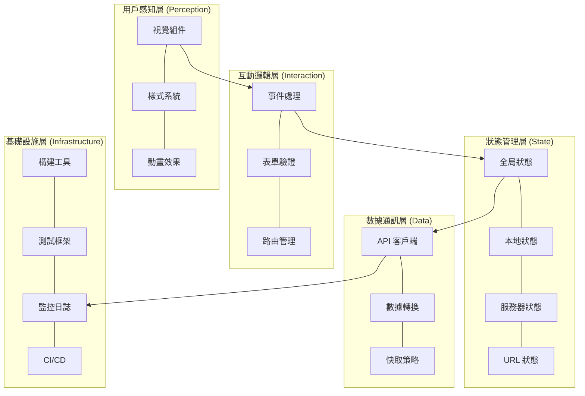
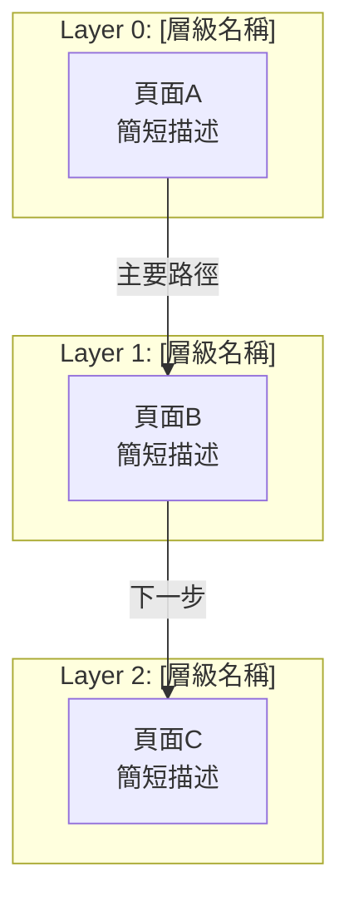
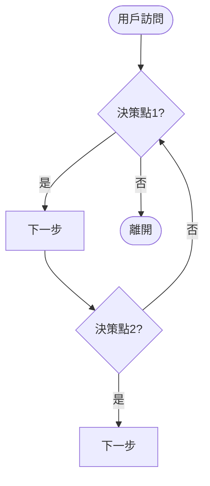

# 前端設計藍圖 (Frontend Design Blueprint) - [專案名稱]

---

**文件版本:** `v1.0`
**最後更新:** `YYYY-MM-DD`
**主要作者:** `[前端架構師, UX/UI Team]`
**審核者:** `[PM, 後端技術負責人, 架構委員會]`
**狀態:** `[草稿 (Draft) / 審核中 (In Review) / 已批准 (Approved)]`

**相關文檔:**
- 專案 PRD: `[連結]`
- 系統架構文檔 (SA): `[連結]`
- API 設計規範: `[連結]`

---

## 目錄

**Part A — 架構與技術基礎** (從 PRD + SA 萃取)
- [1. 架構目標與決策原則](#1-架構目標與決策原則)
- [2. 系統分層架構](#2-系統分層架構)
- [3. 設計系統 (Design System)](#3-設計系統-design-system)
- [4. 技術選型](#4-技術選型)
- [5. 效能與優化策略](#5-效能與優化策略)
- [6. 可用性與無障礙](#6-可用性與無障礙)
- [7. 工程化實踐](#7-工程化實踐)
- [8. 前後端協作契約](#8-前後端協作契約)
- [9. 監控與安全](#9-監控與安全)

**Part B — 資訊架構與頁面規格** (從 PRD + Part A 萃取)
- [10. 核心設計原則與 IA 策略](#10-核心設計原則與-ia-策略)
- [11. 資訊架構總覽](#11-資訊架構總覽)
- [12. 核心用戶旅程](#12-核心用戶旅程)
- [13. 網站地圖與導航結構](#13-網站地圖與導航結構)
- [14. 頁面詳細規格](#14-頁面詳細規格)
- [15. 數據流與狀態管理](#15-數據流與狀態管理)
- [16. URL 結構與路由規範](#16-url-結構與路由規範)

**Part C — 整合檢查清單**
- [17. 開發與品質檢查清單](#17-開發與品質檢查清單)

---

# Part A — 架構與技術基礎

---

## 1. 架構目標與決策原則

> 每一個前端技術決策都應能追溯到其對商業目標的貢獻。

### 1.1 根本目的

| 目的類別 | 核心目標 | 可衡量指標 (KPIs) |
|:---------|:---------|:------------------|
| **商業轉換** | [目標描述] | [轉換率、完成率等] |
| **內容消費** | [目標描述] | [停留時間、跳出率等] |
| **工具效率** | [目標描述] | [任務時間、錯誤率等] |
| **品牌體驗** | [目標描述] | [NPS、品牌回想率等] |

### 1.2 架構終極目標

四個核心維度的平衡：

| 維度 | 定義 | 衡量方式 |
|:-----|:-----|:---------|
| **性能** | 載入與響應速度 | Core Web Vitals, TTI, FCP |
| **可用性** | 任務完成難易度 | 成功率、完成時間、SUS 分數 |
| **可維護性** | 迭代效率與質量 | 複雜度、測試覆蓋率、技術債 |
| **可靠性** | 穩定運行能力 | 錯誤率、崩潰率、SLA |

### 1.3 決策因果鏈

```
明確的商業目標 → 設計與技術決策 → 用戶體驗指標 → 商業成果
```

**本專案關鍵決策：**

| 決策 | 原因 | 預期結果 | 商業影響 |
|:-----|:-----|:---------|:---------|
| [決策1] | [原因] | [結果] | [影響] |
| [決策2] | [原因] | [結果] | [影響] |

---

## 2. 系統分層架構

> 將前端解構為清晰的職責層次，確保關注點分離。



### 2.1 用戶感知層

- **職責**：渲染 UI 組件、應用視覺設計系統、動畫效果
- **原則**：組件化、單一職責、無狀態優先
- **設計模式**：原子設計 (Atoms → Molecules → Organisms → Templates → Pages)

| 方案類別 | 本專案選擇 | 選擇理由 |
|:---------|:-----------|:---------|
| **組件框架** | [React/Vue/Svelte] | [理由] |
| **樣式方案** | [Tailwind/CSS Modules/...] | [理由] |
| **動畫庫** | [Framer Motion/GSAP/無] | [理由] |

### 2.2 互動邏輯層

- **職責**：用戶輸入處理、客戶端驗證、路由導航
- **原則**：事件委派、防抖節流、可訪問性優先

**路由設計：**
```javascript
const routes = [
  { path: '[路徑]', component: [組件], meta: { title: '[標題]', requiresAuth: [true/false] } },
  // ...
];
```

### 2.3 狀態管理層

- **職責**：全局/局部狀態管理、持久化、異步操作

| 狀態類型 | 存儲位置 | 持久化 | 技術方案 |
|:---------|:---------|:-------|:---------|
| 組件 UI 狀態 | Local State | 否 | [useState / ...] |
| 跨組件共享 | Global Store | 選擇性 | [Zustand / Context / ...] |
| 服務器數據 | 查詢緩存 | 選擇性 | [React Query / SWR / ...] |
| 表單狀態 | 表單庫 | 否 | [React Hook Form / ...] |
| URL 狀態 | URL 參數 | 自動 | [Router] |
| 持久化狀態 | LocalStorage | 是 | [Persist middleware / ...] |

### 2.4 數據通訊層

- **職責**：API 通訊、數據轉換、快取與重試

**錯誤分類處理：**

| 錯誤類型 | HTTP 狀態碼 | 用戶提示 | 技術處理 |
|:---------|:------------|:---------|:---------|
| 網絡錯誤 | - | 連接失敗 + 重試 | 自動重試 3 次 |
| 客戶端錯誤 | 400/422 | 表單級錯誤 | 映射到表單 |
| 未授權 | 401 | 重定向登入 | 清除 Token |
| 權限不足 | 403 | 無權限提示 | 記錄日誌 |
| 資源不存在 | 404 | 404 頁面 | 返回首頁 |
| 服務器錯誤 | 500/503 | 服務不可用 | 錯誤報告 |

### 2.5 基礎設施層

- **職責**：構建打包、代碼質量、測試自動化、CI/CD、監控

```
源碼 → Linter → Type Check → Build → Test → Bundle → Deploy
```

---

## 3. 設計系統 (Design System)

> 設計系統是設計與開發之間的共享語言。

### 3.1 設計原則

| 原則 | 定義 | 實踐指南 | 可衡量指標 |
|:-----|:-----|:---------|:-----------|
| **清晰優於炫技** | 功能性優先於複雜度 | 標準 UI 模式、高對比度 | 任務完成時間、錯誤率 |
| **一致性** | 相同功能表現一致 | 統一按鈕/圖標/互動模式 | 組件複用率 |
| **可訪問性** | 所有人都能使用 | WCAG 2.1 AA、鍵盤導航 | A11y 審計得分 |
| **性能優先** | 速度是功能的一部分 | 圖片優化、代碼分割 | Core Web Vitals |

### 3.2 視覺語言系統

#### 色彩系統

```scss
// 品牌色
$color-primary: [色碼];
$color-secondary: [色碼];
$color-tertiary: [色碼];

// 語義色
$color-success: [色碼];
$color-warning: [色碼];
$color-error: [色碼];
$color-info: [色碼];

// 中性色
$color-text-primary: [色碼];
$color-text-secondary: [色碼];
$color-background: [色碼];
$color-surface: [色碼];
$color-divider: [色碼];
```

**對比度檢查：**
- [ ] 正常文字 ≥ 4.5:1 (WCAG AA)
- [ ] 大號文字 ≥ 3:1
- [ ] 互動元素 ≥ 3:1

#### 字體排印系統

```css
:root {
  /* 字體家族 */
  --font-family-base: [字體堆疊];
  --font-family-heading: [字體堆疊];
  --font-family-monospace: [字體堆疊];

  /* 字體大小 - 模塊化比例 [比例值] */
  --font-size-xs: [值];
  --font-size-sm: [值];
  --font-size-base: [值];    /* 16px */
  --font-size-md: [值];
  --font-size-lg: [值];
  --font-size-xl: [值];
  --font-size-2xl: [值];

  /* 行高 */
  --line-height-tight: [值];
  --line-height-normal: [值];
  --line-height-relaxed: [值];

  /* 字重 */
  --font-weight-normal: [值];
  --font-weight-medium: [值];
  --font-weight-bold: [值];
}
```

#### 間距系統

```css
:root {
  /* 8pt 網格系統 */
  --spacing-1: 0.25rem;  /* 4px */
  --spacing-2: 0.5rem;   /* 8px */
  --spacing-3: 0.75rem;  /* 12px */
  --spacing-4: 1rem;     /* 16px */
  --spacing-6: 1.5rem;   /* 24px */
  --spacing-8: 2rem;     /* 32px */
  --spacing-12: 3rem;    /* 48px */
  --spacing-16: 4rem;    /* 64px */
}
```

### 3.3 組件庫架構

```
components/
├── atoms/           # 原子：Button, Input, Icon, Badge
├── molecules/       # 分子：FormField, SearchBox, Card
├── organisms/       # 組織：Header, Footer, DataTable
├── templates/       # 模板：DashboardLayout, AuthLayout
└── pages/           # 頁面：完整視圖
```

**組件檢查清單：**
- [ ] 單一職責、可組合
- [ ] Props 用 TypeScript 定義
- [ ] 包含 ARIA 屬性
- [ ] 有 Storybook 文檔
- [ ] 有單元/快照測試

### 3.4 設計令牌 (Design Tokens)

```json
{
  "color": { "brand": { "primary": { "value": "[色碼]" } } },
  "spacing": { "scale": { "4": { "value": "1rem" } } },
  "typography": { "fontSize": { "base": { "value": "1rem" } } }
}
```

**轉換流程：** Figma → Tokens Studio → JSON → Style Dictionary → CSS/SCSS/JS

---

## 4. 技術選型

### 4.1 框架選擇

| 項目 | 選擇 | 理由 |
|:-----|:-----|:-----|
| **前端框架** | [React / Vue / Svelte] | [理由] |
| **狀態管理** | [Zustand / Redux / Pinia] | [理由] |
| **服務器狀態** | [React Query / SWR] | [理由] |
| **表單庫** | [React Hook Form / Formik] | [理由] |

### 4.2 構建與工具鏈

| 項目 | 選擇 |
|:-----|:-----|
| 構建工具 | [Vite / Webpack / Turbopack] |
| 包管理器 | [pnpm / npm / yarn] |
| 代碼檢查 | [ESLint + Prettier] |
| 類型檢查 | [TypeScript] |
| 測試框架 | [Vitest / Jest + Testing Library] |
| E2E 測試 | [Playwright / Cypress] |
| Git Hooks | [Husky + lint-staged] |
| 提交規範 | [Commitlint (Conventional Commits)] |

### 4.3 樣式方案

| 項目 | 選擇 | 理由 |
|:-----|:-----|:-----|
| **基礎樣式** | [Tailwind / CSS Modules / ...] | [理由] |
| **組件樣式** | [CSS Modules / Vanilla Extract / ...] | [理由] |
| **動畫** | [Framer Motion / GSAP / CSS] | [理由] |

---

## 5. 效能與優化策略

### 5.1 核心網頁指標目標

| 指標 | 全名 | 目標值 | 優化重點 |
|:-----|:-----|:-------|:---------|
| **LCP** | Largest Contentful Paint | < 2.5s | 資源優化、渲染阻塞 |
| **INP** | Interaction to Next Paint | < 200ms | JS 執行時間、長任務拆分 |
| **CLS** | Cumulative Layout Shift | < 0.1 | 圖片尺寸預留、字體策略 |

### 5.2 優化策略清單

**載入優化：**
- [ ] 路由級代碼分割 (lazy / Suspense)
- [ ] 組件級延遲加載
- [ ] 圖片：WebP/AVIF + srcset + loading="lazy"
- [ ] 字體：woff2 + 子集化 + font-display: swap + preload
- [ ] JS：Tree-shaking + 壓縮混淆
- [ ] 預連接/預取：preconnect, dns-prefetch, prefetch

**運行時優化：**
- [ ] 避免不必要重渲染 (memo, useMemo, useCallback)
- [ ] 虛擬化長列表 (react-window / react-virtuoso)
- [ ] Service Worker 緩存策略

---

## 6. 可用性與無障礙

### 6.1 響應式設計

```css
:root {
  --breakpoint-sm: [值];   /* 大手機 */
  --breakpoint-md: [值];   /* 平板 */
  --breakpoint-lg: [值];   /* 筆電 */
  --breakpoint-xl: [值];   /* 桌面 */
}
```

**策略：** [Mobile-first / Desktop-first]

### 6.2 無障礙 (WCAG 2.1)

**Level A (必須)：**
- [ ] 非文本內容有替代文本
- [ ] 顏色不是唯一傳達方式
- [ ] 所有功能可鍵盤操作

**Level AA (推薦)：**
- [ ] 文本對比度 ≥ 4.5:1
- [ ] 頁面標題準確
- [ ] 焦點順序合邏輯
- [ ] 可跳過重複內容

### 6.3 國際化 (i18n)

- 主要語言：[語言]
- 回退語言：[語言]
- 方案：[i18next / react-intl / ...]

---

## 7. 工程化實踐

### 7.1 項目結構

```
src/
├── assets/          # 圖片、字體
├── components/      # 組件庫 (atoms/molecules/organisms)
├── features/        # 功能模塊（按業務領域）
├── layouts/         # 布局組件
├── pages/           # 頁面組件
├── hooks/           # 共享 Hooks
├── utils/           # 工具函數
├── services/        # API 服務層
├── stores/          # 狀態管理
├── styles/          # 全局樣式
├── types/           # TypeScript 類型
└── config/          # 配置文件
```

### 7.2 測試策略

```
       /\
      /E2E\          10% - 關鍵路徑
     /------\
    /Integration\    20% - API 集成
   /------------\
  /  Unit Tests  \   70% - 工具、Hooks、邏輯
 /----------------\
```

| 類型 | 覆蓋率 | 工具 | 重點 |
|:-----|:-------|:-----|:-----|
| 單元測試 | 80%+ | [Vitest/Jest] | 工具函數、Hooks |
| 組件測試 | 70%+ | [Testing Library] | 渲染、互動 |
| E2E 測試 | 關鍵路徑 | [Playwright/Cypress] | 用戶流程 |

### 7.3 CI/CD

- 觸發：push to main/develop, PR
- 流程：Install → Lint → Type Check → Test → Build → Deploy
- 覆蓋率上傳：[Codecov / ...]

---

## 8. 前後端協作契約

### 8.1 API 通訊規範

```typescript
// 統一響應格式
interface ApiResponse<T> {
  success: boolean;
  data: T;
  message?: string;
  errors?: { field?: string; code: string; message: string }[];
}
```

### 8.2 認證與授權

- 方案：[JWT / Session / OAuth]
- Token 存儲：[httpOnly Cookie / localStorage]
- 刷新機制：[自動刷新 / 手動重新登入]

---

## 9. 監控與安全

### 9.1 監控

| 類別 | 指標 | 工具 |
|:-----|:-----|:-----|
| 性能 | LCP, INP, CLS | [Web Vitals + Analytics] |
| 錯誤 | JS 錯誤率、API 錯誤率 | [Sentry / LogRocket] |
| 業務 | 轉換率、停留時間 | [GA / Mixpanel] |

### 9.2 安全檢查清單

- [ ] XSS：框架轉義 + CSP Headers + 避免 dangerouslySetInnerHTML
- [ ] CSRF：SameSite Cookies 或 CSRF Token
- [ ] 數據：敏感資料用 httpOnly cookies、HTTPS 傳輸
- [ ] 依賴：定期 `npm audit` + Dependabot

---

# Part B — 資訊架構與頁面規格

---

## 10. 核心設計原則與 IA 策略

### 10.1 核心價值主張

> 「[一句話描述專案為用戶提供的核心價值]」

**第一性原理推演：**
```
商業目標：[描述]
    ↓
用戶需求：[描述]
    ↓
設計策略：[描述]
    ↓
架構決策：[描述]
```

### 10.2 資訊架構原則

#### 簡化原則
- ✅ **保留**：[核心功能清單]
- ❌ **移除**：[刻意排除的功能]
- 🎯 **專注**：[核心聚焦點]

#### 認知負荷優化
- **決策點數量**：[從 X 減到 Y]
- **每頁專注度**：[每頁 1 個主要目標]
- **資訊分層**：[先總覽再深入]

#### 架構模式
- [ ] 扁平化架構（簡單流程、少量頁面）
- [ ] 層級化架構（複雜系統、多層導航）
- [ ] 中心輻射架構（工具型應用）
- [ ] 混合架構

**選擇：** [模式名稱] — **理由：** [說明]

---

## 11. 資訊架構總覽

### 11.1 系統層次結構



### 11.2 頁面總覽矩陣

| # | 頁面檔名 | 頁面名稱 | 主要職責 | 用戶目標 | 預期停留 | 導航深度 |
|:--|:---------|:---------|:---------|:---------|:---------|:---------|
| 0 | `[檔名]` | [名稱] | [職責] | [目標] | [時間] | Level 0 |
| 1 | `[檔名]` | [名稱] | [職責] | [目標] | [時間] | Level 1 |
| ... | ... | ... | ... | ... | ... | ... |

**總計：** [N] 頁

---

## 12. 核心用戶旅程

### 12.1 主要旅程

```mermaid
graph LR
    A[階段1<br/>[頁面]<br/>[時間]] --> B[階段2<br/>[頁面]<br/>[時間]]
    B --> C[階段3<br/>[頁面]<br/>[時間]]
    C --> D[階段4<br/>[頁面]<br/>[時間]]
```

### 12.2 用戶旅程映射表

| 階段 | 頁面 | 用戶心理狀態 | 設計目標 | 主要 CTA | 預期停留 | 轉換率目標 |
|:-----|:-----|:-------------|:---------|:---------|:---------|:-----------|
| [階段名] | [頁面] | [心理] | [目標] | [CTA] | [時間] | [%] |
| ... | ... | ... | ... | ... | ... | ... |

### 12.3 決策點分析



**總決策點：** [N] 個

---

## 13. 網站地圖與導航結構

### 13.1 完整網站地圖

```
[網站名稱] (/)
│
├─ 0. [頁面A] [層級名稱]
│  └─ → [主要出口]
│
├─ 1. [頁面B] [層級名稱]
│  ├─ #[錨點1]
│  └─ → [主要出口]
│
├─ 2. [頁面C] [層級名稱]
│  ├─ Query: ?[參數]={值}
│  ├─ → [出口1]
│  └─ ← [返回路徑]
│
└─ [繼續...]
```

### 13.2 導航連結矩陣

| 來源 \ 目標 | [頁面A] | [頁面B] | [頁面C] | [頁面D] |
|:------------|:--------|:--------|:--------|:--------|
| **[頁面A]** | - | ✅ [類型] | ❌ | ❌ |
| **[頁面B]** | ✅ [類型] | - | ✅ [類型] | ❌ |
| **[頁面C]** | ❌ | ✅ [類型] | - | ✅ [類型] |
| **[頁面D]** | ✅ [類型] | ❌ | ✅ [類型] | - |

> ✅ 推薦路徑 | ⚠️ 需確認（有驗證） | ❌ 不存在

---

## 14. 頁面詳細規格

> 為每個核心頁面複製以下模板填寫。

### 14.X [頁面名稱]

#### 基本信息

| 屬性 | 值 |
|:-----|:---|
| **檔名** | `[filename]` |
| **URL** | `[/path]` |
| **URL 參數** | `[參數]=[說明]`（[必須/可選]） |
| **頁面類型** | [營銷/功能/表單/儀表板/...] |
| **導航深度** | Level [N] |

#### 職責與目標

| 項目 | 內容 |
|:-----|:-----|
| **主要任務** | [此頁首要職責] |
| **次要任務** | [次要職責] |
| **用戶目標** | [用戶想達成什麼] |
| **轉換目標** | [預期行為與轉換率] |

#### 關鍵組件結構

```html
<page-structure>
  <!-- 1. [區塊名稱] -->
  <section class="[class]">
    <component>[說明]</component>
  </section>

  <!-- 2. [區塊名稱] -->
  <section class="[class]">
    <!-- 組件定義 -->
  </section>
</page-structure>
```

#### 導航出口

```javascript
{
  primary: '[主要目標頁面]',
  secondary: '[次要目標頁面]',
  back: '[返回頁面]'
}
```

#### 關鍵指標 (KPIs)

| 指標 | 目標值 | 衡量方式 |
|:-----|:-------|:---------|
| [指標名] | [目標] | [方式] |

#### 驗收標準

- [ ] [功能標準1]
- [ ] [功能標準2]
- [ ] [視覺標準]
- [ ] [效能標準]

---

## 15. 數據流與狀態管理

### 15.1 數據流向圖

```mermaid
graph TB
    subgraph "Frontend"
        A[頁面A] --> B[本地存儲]
        C[頁面B]
    end
    subgraph "Backend API"
        E[/api/endpoint1]
        F[/api/endpoint2]
    end
    A -->|POST| E
    E -->|返回| A
    C -->|GET| F
    F -->|返回| C
```

### 15.2 狀態持久化策略

| 數據 | 存儲方式 | 有效期 | 說明 |
|:-----|:---------|:-------|:-----|
| [數據名] | [localStorage/sessionStorage/IndexedDB] | [時間] | [說明] |

---

## 16. URL 結構與路由規範

### 16.1 完整 URL 清單

```
站點根目錄: [URL]

核心頁面:
├── /[path1]                      [用途]
├── /[path2]?[param]={value}      [用途] *參數必須
└── /[path3]                      [用途]

API 端點:
├── [METHOD] /api/[endpoint1]     [用途]
├── [METHOD] /api/[endpoint2]     [用途]
└── [METHOD] /api/[endpoint3]     [用途]
```

### 16.2 URL 驗證與錯誤處理

| 情境 | 處理方式 |
|:-----|:---------|
| 缺少必要參數 | [提示 + 重定向到...] |
| 參數格式無效 | [提示 + 重定向到...] |
| 頁面不存在 | [404 頁面] |

---

# Part C — 整合檢查清單

---

## 17. 開發與品質檢查清單

### 17.1 開發階段

**設計與規劃：**
- [ ] 已審查 PRD 與設計稿
- [ ] 已定義組件層級與複用策略
- [ ] 已規劃狀態管理方案
- [ ] 已與後端確認 API 契約

**代碼實現：**
- [ ] 組件符合單一職責
- [ ] Props 使用 TypeScript 嚴格類型
- [ ] 實施錯誤邊界 (Error Boundaries)
- [ ] 使用設計令牌而非硬編碼
- [ ] 響應式在三種斷點測試

### 17.2 測試階段

**功能測試：**
- [ ] 所有用戶流程端到端可走通
- [ ] 表單驗證正確
- [ ] 錯誤/載入/空狀態正確展示

**兼容性與無障礙：**
- [ ] 主流瀏覽器測試 (Chrome, Firefox, Safari, Edge)
- [ ] 手機平板真機測試
- [ ] 鍵盤導航可用
- [ ] 螢幕閱讀器基本可用

**性能：**
- [ ] Lighthouse > 90
- [ ] LCP < 2.5s, INP < 200ms, CLS < 0.1
- [ ] 包體積 < [N]KB gzipped

### 17.3 上線前

**代碼審查：**
- [ ] 通過 ESLint + TypeScript
- [ ] 至少一名同事 Code Review
- [ ] 無 console.log / debugger 殘留

**部署：**
- [ ] CI/CD 流程通過
- [ ] 環境變數文檔更新
- [ ] 已建立回滾計劃

**安全與監控：**
- [ ] API Keys 不在代碼中硬編碼
- [ ] Sentry / 錯誤監控已設置
- [ ] Web Vitals 監控已設置
- [ ] npm audit 通過

### 17.4 上線門檻 (Go/No-Go)

- [ ] 所有 P0 功能完成並測試通過
- [ ] 無阻斷性 Bug
- [ ] 性能指標達標
- [ ] 安全掃描通過

**角色簽核：**

| 角色 | 責任 | 簽核 | 日期 |
|:-----|:-----|:-----|:-----|
| PM | 需求滿足 | ⬜ | |
| Frontend Lead | 技術品質 | ⬜ | |
| QA | 測試覆蓋 | ⬜ | |

---

## 附錄

### A. 術語表

| 術語 | 英文 | 定義 |
|:-----|:-----|:-----|
| 信息架構 | Information Architecture (IA) | 組織、結構化和標記內容的方法 |
| 設計令牌 | Design Tokens | 設計系統的最小視覺元素 |
| 無障礙性 | Accessibility (A11y) | 確保所有人都能使用產品 |
| [專案術語] | [英文] | [定義] |

### B. 相關文檔

| 文檔 | 路徑 |
|:-----|:-----|
| PRD | [路徑] |
| API 設計 | [路徑] |
| Figma 設計文件 | [連結] |
| Storybook 組件庫 | [連結] |

### C. 變更記錄

| 日期 | 版本 | 作者 | 變更摘要 |
|:-----|:-----|:-----|:---------|
| YYYY-MM-DD | v1.0 | [作者] | 初版（合併前端架構 + 資訊架構） |

---

**最後更新：** YYYY-MM-DD
**維護者：** [團隊名稱]
