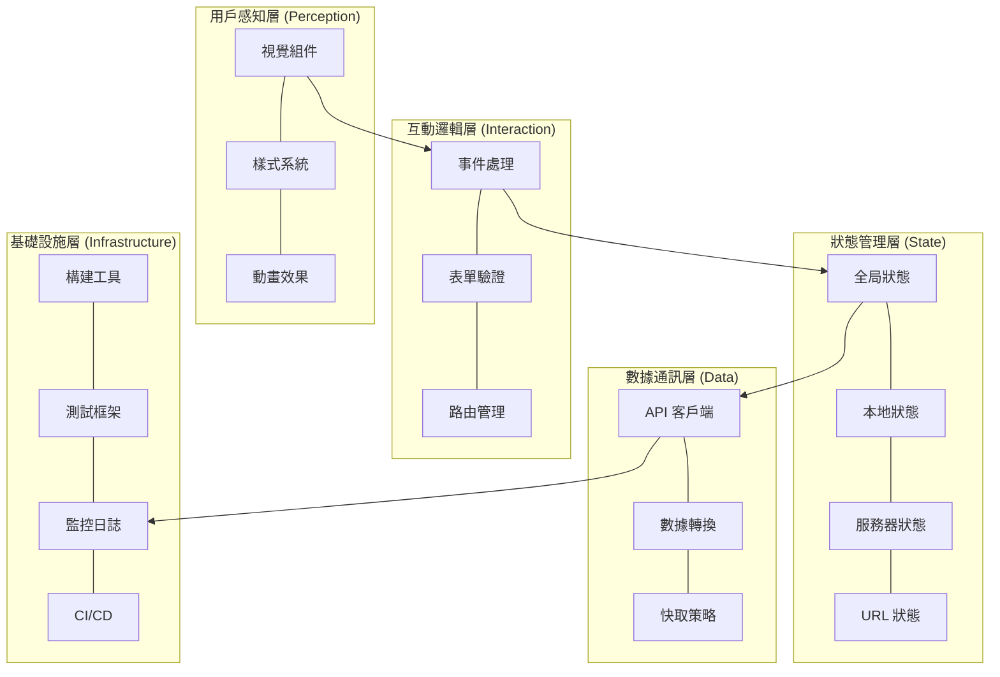
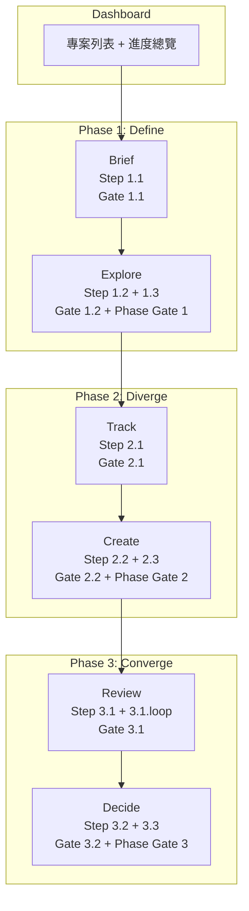
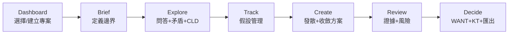
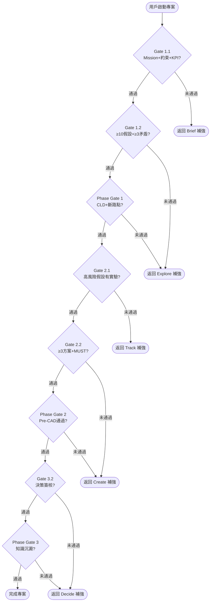

# 前端設計藍圖 (Frontend Design Blueprint) - RD Design Copilot

---

**文件版本:** `v2.0`
**最後更新:** `2026-02-25`
**主要作者:** `AI Agent`
**審核者:** `User/AI Agent`
**狀態:** `Draft`

**相關文檔:**
- 專案 PRD: `docs/e2e/PRD_RD_Design_Copilot.md`
- 系統架構文檔 (SA):
    - `docs/e2e/RD_Design_Copilot_整合流程.md`
    - `docs/e2e/RD_Design_Copilot_State_Machine.md`
    - `docs/e2e/AI_Agent_Architecture.md`
- UI 簡易設計: `rd_assistant_design_system/system_architecture/UI_簡易設計.md`
- 命名規範: `docs/e2e/Naming_Convention.md`

---

## 目錄

**Part A — 架構與技術基礎** (從 PRD + SA 萃取)
- [1. 架構目標與決策原則](#1-架構目標與決策原則)
- [2. 系統分層架構](#2-系統分層架構)
    - [2.1 用戶感知層](#21-用戶感知層)
    - [2.1.1 積極反饋機制 (Positive Feedback Mechanisms)](#211-積極反饋機制-positive-feedback-mechanisms)
    - [2.2 互動邏輯層](#22-互動邏輯層)
    - [2.2.1 複雜互動模式 (Complex Interaction Patterns)](#221-複雜互動模式-complex-interaction-patterns)
    - [2.3 狀態管理層](#23-狀態管理層)
    - [2.4 數據通訊層](#24-數據通訊層)
    - [2.5 基礎設施層](#25-基礎設施層)
- [3. 設計系統 (Design System)](#3-設計系統-design-system)
- [4. 技術選型](#4-技術選型)
- [5. 效能與優化策略](#5-效能與優化策略)
- [6. 可用性與無障礙](#6-可用性與無障礙)
- [7. 工程化實踐](#7-工程化實踐)
- [8. 前後端協作契約](#8-前後端協作契約)
- [9. 監控與安全](#9-監控與安全)

**Part B — 資訊架構與頁面規格** (6+1 頁面架構, Apple 設計哲學)
- [10. 核心設計原則與 IA 策略](#10-核心設計原則與-ia-策略)
- [11. 6+1 頁面架構總覽](#11-61-頁面架構總覽)
- [12. 核心用戶旅程](#12-核心用戶旅程)
- [13. 網站地圖與導航結構](#13-網站地圖與導航結構)
- [14. 頁面詳細規格](#14-頁面詳細規格)
- [15. 數據流與狀態管理](#15-數據流與狀態管理)
- [16. URL 結構與路由規範](#16-url-結構與路由規範)

**Part C — 整合檢查清單**
- [17. 開發與品質檢查清單](#17-開發與品質檢查清單)

---

# Part A — 架構與技術基礎

---

## 1. 架構目標與決策原則

> 每一個前端技術決策都應能追溯到其對商業目標的貢獻。

### 1.1 根本目的

| 目的類別 | 核心目標 | 可衡量指標 (KPIs) |
|:---------|:---------|:------------------|
| **商業轉換** | 提升早期設計決策效率與方案品質 | 概念評審效率 ≤2 hr/次 (KPI-2)、方案探索數量 ≥3 條 (KPI-4) |
| **內容消費** | N/A | N/A |
| **工具效率** | 提高早期設計階段的生產力與準確性 | 假設驗證覆蓋率 ≥80% (KPI-3)、用戶採納率 ≥70% (KPI-6) |
| **品牌體驗** | N/A | N/A |

### 1.2 架構終極目標

四個核心維度的平衡：

| 維度 | 定義 | 衡量方式 |
|:-----|:-----|:---------|
| **性能** | 系統響應速度與處理能力 | 任務定義表生成時間 ≤30s, TRIZ 解法生成時間 ≤60s, 方案集合載入時間 ≤3s, 並發用戶數 ≥50 |
| **可用性** | 用戶學習曲線、操作便利性與多語言支援 | 新用戶 2 小時內完成首個專案, 支援繁體中文/英文, 匯出格式多樣性 |
| **可維護性** | 系統配置彈性與知識庫更新能力 | 模板可配置, 知識庫可更新, API 文件完整性 |
| **可靠性** | 系統穩定運行與資料安全性 | 系統可用性 ≥99.5%, 資料每日備份, 資料恢復時間 ≤4hr |

### 1.3 決策因果鏈

```
明確的商業目標 → 設計與技術決策 → 用戶體驗指標 → 商業成果
```

**本專案關鍵決策：**

| 決策 | 原因 | 預期結果 | 商業影響 |
|:-----|:-----|:---------|:---------|
| 引入 AI 輔助的結構化設計流程 | 解決早期概念設計「三重困境」（未知最多、決策最重、時間最緊），避免高昂返工成本 | 擴大設計可能性空間，使未知可見可追蹤，前置風險驗證，決策可審查可複用，提升溝通效率 | 降低架構級返工次數 (KPI-1 ≤2 次), 提升概念評審效率 (KPI-2 ≤2 hr/次), 增加用戶採納率 (KPI-6 ≥70%) |

---

## 2. 系統分層架構

> 將前端解構為清晰的職責層次，確保關注點分離。



### 2.1 用戶感知層

- **職責**：渲染 UI 組件、應用視覺設計系統、動畫效果
- **原則**：組件化、單一職責、無狀態優先
- **設計模式**：原子設計 (Atoms → Molecules → Organisms → Templates → Pages)

| 方案類別 | 本專案選擇 | 選擇理由 |
|:---------|:-----------|:---------|
| **組件框架** | React | PRD 推薦，生態系統成熟，利於構建複雜 UI |
| **樣式方案** | Tailwind CSS | 快速開發，原子化 CSS，與 React 生態整合良好 |
| **動畫庫** | Framer Motion | 聲明式動畫，易於與 React 組件結合 |

### 2.1.1 積極反饋機制 (Positive Feedback Mechanisms)

- **職責**：通過及時、清晰、積極的反饋，增強用戶的操作信心和滿意度。
- **原則**：明確告知用戶操作結果，避免不確定性，提升用戶體驗的愉悅感。

| 反饋類型 | 設計考量 | 預期行為 |
|:---------|:---------|:---------|
| **成功訊息** | 簡潔、明確、不干擾用戶流程、支持自動消失 | 用戶完成關鍵操作 (如保存、提交) 後，介面能即時顯示成功提示，讓用戶安心。 |
| **確認模式** | 用於高風險或不可逆操作、提供再次確認機會 | 用戶執行刪除、發布等操作前，提供模態框或輕量級提示再次確認，防止誤操作。 |
| **微互動/動畫** | 輕量、快速、視覺愉悅、不分散主要注意力 | 用戶點擊按鈕、完成表單等操作時，通過按鈕動效、勾選動畫、載入動畫等增加趣味性和即時反饋。 |

### 2.2 互動邏輯層

- **職責**：用戶輸入處理、客戶端驗證、路由導航
- **原則**：事件委派、防抖節流、可訪問性優先

**路由設計：**
```javascript
const routes = [
  { path: '/projects', component: ProjectList, meta: { title: '專案列表', requiresAuth: true } },
  { path: '/projects/:id/define', component: TaskDefinitionPage, meta: { title: '任務定義', requiresAuth: true } },
  { path: '/decisions/:id', component: DecisionRecordPage, meta: { title: '決策記錄', requiresAuth: true } },
];
```

### 2.2.1 複雜互動模式 (Complex Interaction Patterns)

- **職責**：處理拖放、實時更新、互動式圖表等高階用戶互動。
- **原則**：提供清晰的反饋、確保操作流暢、支持鍵盤導航、考慮性能開銷。

| 互動類型 | 設計考量 | 預期行為 |
|:---------|:---------|:---------|
| **拖放** | 視覺提示 (拖動元素樣式變化, 放置區域高亮)、操作取消 (ESC 鍵)、性能優化 (虛擬化列表) | 用戶可直觀地重新排序列表或移動元素，並獲得即時視覺反饋。 |
| **實時更新** | 更新頻率、數據同步策略、衝突解決、視覺提示 (新數據標記) | 多用戶協作或數據頻繁變更時，介面能流暢且一致地顯示最新信息。 |
| **互動式圖表** | 縮放、平移、點擊事件、工具提示、性能優化 (數據抽樣) | 用戶能探索數據、篩選信息，並從圖表中獲取詳細見解。 |

### 2.3 狀態管理層

- **職責**：全局/局部狀態管理、持久化、異步操作

| 狀態類型 | 存儲位置 | 持久化 | 技術方案 |
|:---------|:---------|:-------|:---------|
| 組件 UI 狀態 | Local State | 否 | useState |
| 跨組件共享 | Global Store | 選擇性 | Zustand |
| 服務器數據 | 查詢緩存 | 選擇性 | React Query |
| 表單狀態 | 表單庫 | 否 | React Hook Form |
| URL 狀態 | URL 參數 | 自動 | React Router |
| 持久化狀態 | LocalStorage | 是 | Zustand persist middleware |

### 2.4 數據通訊層

- **職責**：API 通訊、數據轉換、快取與重試

**錯誤分類處理：**

| 錯誤類型 | HTTP 狀態碼 | 用戶提示 | 技術處理 |
|:---------|:------------|:---------|:---------|
| 網絡錯誤 | - | 連接失敗 + 重試 | 自動重試 (如 SWR/React Query 內建) |
| 客戶端錯誤 | 400/422 | 表單級錯誤 | 映射到表單字段 |
| 未授權 | 401 | 重定向登入 | 清除 Token, 跳轉登入頁 |
| 權限不足 | 403 | 無權限提示 | 記錄日誌, 顯示權限不足頁 |
| 資源不存在 | 404 | 404 頁面 | 導航到自定義 404 頁面 |
| 服務器錯誤 | 500/503 | 服務不可用 | 錯誤報告至 Sentry |

### 2.5 基礎設施層

- **職責**：構建打包、代碼質量、測試自動化、CI/CD、監控

```
源碼 → Linter → Type Check → Build → Test → Bundle → Deploy
```

| 方案類別 | 本專案選擇 | 選擇理由 |
|:---------|:-----------|:---------|
| **構建工具** | Vite | 開發體驗佳，啟動速度快 |
| **包管理器** | pnpm | 節省磁碟空間，提升安裝速度 |
| **代碼檢查** | ESLint + Prettier | 統一代碼風格，減少潛在錯誤 |
| **類型檢查** | TypeScript | 提升代碼可靠性與可維護性 |
| **測試框架** | Vitest + Testing Library | 快速單元測試，模擬用戶行為 |
| **E2E 測試** | Playwright | 跨瀏覽器測試，提供強大調試能力 |
| **Git Hooks** | Husky + lint-staged | 在提交前執行檢查，確保代碼質量 |
| **提交規範** | Conventional Commits | 統一提交訊息格式，自動生成變更日誌 |

---

## 3. 設計系統 (Design System)

> 設計系統是設計與開發之間的共享語言。

### 3.1 設計原則

| 原則 | 定義 | 實踐指南 | 可衡量指標 |
|:-----|:-----|:---------|:-----------|
| **清晰優於炫技** | 功能性優先於複雜度 | 標準 UI 模式、高對比度 | 任務完成時間、錯誤率 |
| **一致性** | 相同功能表現一致 | 統一按鈕/圖標/互動模式 | 組件複用率 |
| **可訪問性** | 所有人都能使用 | WCAG 2.1 AA、鍵盤導航 | A11y 審計得分 |
| **性能優先** | 速度是功能的一部分 | 圖片優化、代碼分割 | Core Web Vitals |

### 3.2 視覺語言系統

#### 色彩系統

```scss
// 品牌色
$color-primary: #007bff; // Blue
$color-secondary: #6c757d; // Gray
$color-tertiary: #fd7e14; // Orange

// 語義色
$color-success: #28a745; // Green
$color-warning: #ffc107; // Yellow
$color-error: #dc3545; // Red
$color-info: #17a2b8; // Cyan

// 中性色
$color-text-primary: #212529; // Dark Gray
$color-text-secondary: #6c757d; // Medium Gray
$color-background: #f8f9fa; // Light Gray
$color-surface: #ffffff; // White
$color-divider: #e9ecef; // Lighter Gray
```

**對比度檢查：**
- [x] 正常文字 ≥ 4.5:1 (WCAG AA)
- [x] 大號文字 ≥ 3:1
- [x] 互動元素 ≥ 3:1

#### 字體排印系統

```css
:root {
  /* 字體家族 */
  --font-family-base: "Noto Sans TC", "Helvetica Neue", Arial, "Segoe UI", sans-serif;
  --font-family-heading: "Noto Sans TC", "Helvetica Neue", Arial, "Segoe UI", sans-serif;
  --font-family-monospace: "SFMono-Regular", Menlo, Monaco, Consolas, "Liberation Mono", "Courier New", monospace;

  /* 字體大小 - 模塊化比例 1.25 (Major Third) */
  --font-size-xs: 0.64rem;  /* ~10px */
  --font-size-sm: 0.8rem;   /* ~12.8px */
  --font-size-base: 1rem;   /* 16px */
  --font-size-md: 1.25rem;  /* ~20px */
  --font-size-lg: 1.563rem; /* ~25px */
  --font-size-xl: 1.953rem; /* ~31px */
  --font-size-2xl: 2.441rem;/* ~39px */

  /* 行高 */
  --line-height-tight: 1.2;
  --line-height-normal: 1.5;
  --line-height-relaxed: 1.75;

  /* 字重 */
  --font-weight-normal: 400;
  --font-weight-medium: 500;
  --font-weight-bold: 700;
}
```

#### 間距系統

```css
:root {
  /* 8pt 網格系統 */
  --spacing-1: 0.25rem;  /* 4px */
  --spacing-2: 0.5rem;   /* 8px */
  --spacing-3: 0.75rem;  /* 12px */
  --spacing-4: 1rem;     /* 16px */
  --spacing-6: 1.5rem;   /* 24px */
  --spacing-8: 2rem;     /* 32px */
  --spacing-12: 3rem;    /* 48px */
  --spacing-16: 4rem;    /* 64px */
}
```

### 3.3 組件庫架構

```
components/
├── atoms/           # 原子：Button, Input, Icon, Badge
├── molecules/       # 分子：FormField, SearchBox, Card
├── organisms/       # 組織：Header, Footer, DataTable
├── templates/       # 模板：DashboardLayout, AuthLayout
└── pages/           # 頁面：完整視圖
```

**組件檢查清單：**
- [ ] 單一職責、可組合
- [ ] Props 用 TypeScript 定義
- [ ] 包含 ARIA 屬性
- [ ] 有 Storybook 文檔 (若有導入)
- [ ] 有單元/快照測試

### 3.4 設計令牌 (Design Tokens)

```json
{
  "color": { "brand": { "primary": { "value": "#007bff" } } },
  "spacing": { "scale": { "4": { "value": "1rem" } } },
  "typography": { "fontSize": { "base": { "value": "1rem" } } }
}
```

**轉換流程：** Figma → Tokens Studio → JSON → Style Dictionary → CSS/SCSS/JS (若有導入設計令牌流程)

---

## 4. 技術選型

### 4.1 框架選擇

| 項目 | 選擇 | 理由 |
|:-----|:-----|:-----|
| **前端框架** | React | PRD 推薦，生態系統成熟，社群活躍 |
| **狀態管理** | Zustand | 輕量、快速、易於學習和使用 |
| **服務器狀態** | React Query | 強大的數據同步、緩存和優化功能 |
| **表單庫** | React Hook Form | 性能優異，靈活且易於整合 |

### 4.2 構建與工具鏈

| 項目 | 選擇 |
|:-----|:-----|
| 構建工具 | Vite |
| 包管理器 | pnpm |
| 代碼檢查 | ESLint + Prettier |
| 類型檢查 | TypeScript |
| 測試框架 | Vitest + Testing Library |
| E2E 測試 | Playwright |
| Git Hooks | Husky + lint-staged |
| 提交規範 | Conventional Commits |

### 4.3 樣式方案

| 項目 | 選擇 | 理由 |
|:-----|:-----|:-----|
| **基礎樣式** | Tailwind CSS | Utility-first 框架，加速 UI 開發 |
| **組件樣式** | CSS Modules | 提供組件級別的樣式隔離，避免衝突 |
| **動畫** | Framer Motion | 聲明式動畫 API，與 React 完美結合 |

---

## 5. 效能與優化策略

### 5.1 核心網頁指標目標

| 指標 | 全名 | 目標值 | 優化重點 |
|:-----|:-----|:-------|:---------|
| **LCP** | Largest Contentful Paint | < 2.5s | 資源優化、關鍵渲染路徑優化、CDN |
| **INP** | Interaction to Next Paint | < 200ms | JS 執行時間優化、長任務拆分、避免過度渲染 |
| **CLS** | Cumulative Layout Shift | < 0.1 | 圖片/媒體尺寸預留、字體加載策略、動態內容管理 |

### 5.2 優化策略清單

**載入優化：**
- [ ] 路由級代碼分割 (lazy / Suspense)
- [ ] 組件級延遲加載 (如非首屏關鍵組件)
- [ ] 圖片：WebP/AVIF 格式 + srcset 響應式圖片 + loading="lazy"
- [ ] 字體：woff2 + 子集化 + font-display: swap + preload 關鍵字體
- [ ] JS：Tree-shaking + 壓縮混淆，減少包體積
- [ ] 預連接/預取：preconnect, dns-prefetch, prefetch 關鍵資源

**運行時優化：**
- [ ] 避免不必要重渲染 (React.memo, useMemo, useCallback)
- [ ] 虛擬化長列表 (如 react-window / react-virtuoso)
- [ ] Service Worker 緩存策略 (PWA 考慮)
- [ ] Web Workers 處理計算密集型任務
- [ ] 妥善利用瀏覽器緩存 (Cache-Control, ETag)

---

## 6. 可用性與無障礙

### 6.1 響應式設計

```css
:root {
  --breakpoint-sm: 640px;   /* 大手機 */
  --breakpoint-md: 768px;   /* 平板 */
  --breakpoint-lg: 1024px;   /* 筆電 */
  --breakpoint-xl: 1280px;   /* 桌面 */
}
```

**策略：** Mobile-first

### 6.2 無障礙 (WCAG 2.1)

**Level A (必須)：**
- [x] 非文本內容有替代文本 (圖片 alt 屬性)
- [x] 顏色不是唯一傳達方式 (需輔以文字或圖標)
- [x] 所有功能可鍵盤操作 (焦點管理、Tab 順序)

**Level AA (推薦)：**
- [x] 文本對比度 ≥ 4.5:1
- [x] 頁面標題準確
- [x] 焦點順序合邏輯
- [x] 可跳過重複內容 (Skip Link)

### 6.3 國際化 (i18n)

- 主要語言：繁體中文
- 回退語言：英文
- 方案：react-i18next

---

## 7. 工程化實踐

### 7.1 項目結構

```
src/
├── assets/          # 圖片、字體、靜態資源
├── components/      # 通用 UI 組件 (atoms/molecules/organisms)
├── features/        # 功能模塊（按業務領域劃分，如 project, decision, assumption）
├── layouts/         # 布局組件 (如 Header, Footer, Sidebar)
├── pages/           # 頁面組件 (直接對應路由)
├── hooks/           # 共享 Hooks (如 useAuth, useDebounce)
├── utils/           # 工具函數 (如日期格式化, 數據處理)
├── services/        # API 服務層 (如 api.ts, auth.ts)
├── stores/          # 狀態管理 (Zustand store)
├── styles/          # 全局樣式 (如 base.css, variables.css)
├── types/           # TypeScript 類型定義
└── config/          # 配置文件 (如環境變數, 常量)
```

### 7.2 測試策略

```
       /
      /E2E\          10% - 關鍵用戶旅程
     /------
    /Integration\    20% - 功能模塊、API 集成
   /------------
  /  Unit Tests  \   70% - 工具函數、Hooks、核心邏輯
 /----------------
```

| 類型 | 覆蓋率目標 | 工具 | 重點 |
|:-----|:-------|:-----|:-----|
| 單元測試 | 80%+ | Vitest + Testing Library | 工具函數、Hooks、純函數邏輯 |
| 組件測試 | 70%+ | Testing Library | 組件渲染、互動、可訪問性 |
| E2E 測試 | 關鍵路徑 | Playwright | 用戶關鍵業務流程，跨頁面互動 |

### 7.3 CI/CD

- 觸發：push to main/develop, Pull Request 合併
- 流程：Install Dependencies → Lint Check → Type Check → Run Tests (Unit/Component) → Build Application → Run E2E Tests → Deploy to Staging/Production
- 覆蓋率上傳：Codecov (或類似工具)
- 自動化部署：Jenkins / GitHub Actions / GitLab CI

---

## 8. 前後端協作契約

### 8.1 API 通訊規範

```typescript
// 統一響應格式
interface ApiResponse<T> {
  success: boolean;
  data: T;
  message?: string;
  errors?: { field?: string; code: string; message: string }[];
}
```
- **RESTful API**：遵循 RESTful 設計原則，使用標準 HTTP 方法。
- **數據格式**：請求和響應均採用 JSON 格式。
- **錯誤處理**：統一的錯誤響應格式，包含錯誤碼和描述。

### 8.2 認證與授權

- 方案：JWT (JSON Web Tokens) / OAuth (若整合 SSO/LDAP)
- Token 存儲：HttpOnly Cookie (防止 XSS 攻擊) 或 Local Storage (需搭配額外安全措施)
- 刷新機制：自動刷新 (使用 Refresh Token) / 手動重新登入 (Refresh Token 過期後)

---

## 9. 監控與安全

### 9.1 監控

| 類別 | 指標 | 工具 |
|:-----|:-----|:-----|
| 性能 | LCP, INP, CLS (Core Web Vitals) | Google Analytics / Web Vitals Reporting |
| 錯誤 | JS 錯誤率、API 錯誤率、崩潰率 | Sentry |
| 業務 | 概念評審效率, 假設驗證覆蓋率, 用戶採納率 | Google Analytics / 自定義儀表板 |

### 9.2 安全檢查清單

- [x] XSS：框架自動轉義 + CSP Headers 配置 + 避免使用 `dangerouslySetInnerHTML`
- [x] CSRF：使用 HttpOnly Cookie + SameSite 屬性 (Lax/Strict) 或 CSRF Token
- [x] 數據：敏感資料透過 HTTPS 傳輸，後端加密存儲；前端不直接處理敏感數據
- [x] 依賴：定期執行 `npm audit` 或 `pnpm audit`，並使用 Dependabot 等工具自動化檢查和更新依賴
- [x] 用戶認證：遵循 PRD NFR-8 (支援 SSO/LDAP 整合) 提供的方案
- [x] 權限控制：前端基於用戶角色顯示/隱藏功能，並在 API 層嚴格驗證權限

---

# Part B — 資訊架構與頁面規格

---

## 10. 核心設計原則與 IA 策略

### 10.1 核心價值主張

> 「RD Design Copilot 是一套 AI 輔助的早期概念設計系統，把「未知」變成「可追蹤的假設」，把「靈感」變成「可審查的方案」，把「試錯」變成「最小實驗」。 」

**第一性原理推演：**
```
商業目標：解決早期概念設計「三重困境」（未知最多、決策最重、時間最緊），降低返工成本。
    ↓
用戶需求：擴大設計可能性，使假設可追蹤，前置風險驗證，決策有依據。
    ↓
設計策略：結構化發散、嚴格收斂、最小驗證。
    ↓
架構決策：6+1 頁面架構 + 8-Gate 內嵌系統 + AI 隱形基礎設施。
```

### 10.2 Apple 設計哲學三支柱

| 原則 | 定義 | 在本系統的實踐 |
|:-----|:-----|:---------------|
| **Progressive Disclosure** | 只在需要時才顯示複雜度 | Gate 內嵌於頁面底部，不另開頁面；子步驟用 Accordion 漸進展開 |
| **Direct Manipulation** | 用戶操作即產出 | 填表 = 建立工件；拖拉 = 排序方案；點擊 = 展開細節 |
| **AI as Invisible Infrastructure** | AI 是基礎設施，不是主角 | 用戶看到的是「結果卡片」，不是「AI 正在思考」 |

### 10.3 必填 vs Agent 處理 分類原則

| 分類 | 說明 | 視覺表現 |
|:-----|:-----|:---------|
| **必填** (Human Input) | 用戶必須提供的核心判斷 | 白底輸入框 + 紅色星號 ★ |
| **Agent 處理** (Auto) | AI 自動生成，用戶可修改 | 灰底卡片 + `[AI]` 標籤 + 編輯按鈕 |
| **必須呈現** (Display) | 系統計算結果，不可編輯 | 彩色徽章 / 進度條 / 圖表 |

### 10.4 資訊架構原則

#### 簡化原則（6+1 頁面 vs 舊版 10+ 頁面）
- **合併相關步驟**：將同一認知階段的步驟合併到同一頁面，用 Tabs 切換
- **Gate 不佔頁面**：Gate 內嵌在功能頁底部，作為 checklist 指示器
- **AI 結果預設收合**：避免資訊過載，用戶需要時才展開

#### 認知負荷優化
- **決策點數量**：8 個 Gate 分散在 6 個頁面中，每頁最多 2 個 Gate
- **每頁專注度**：每頁聚焦一個認知階段（定義/探索/追蹤/創造/審查/決策）
- **資訊分層**：Phase 色帶 → 頁面 Tabs → Accordion 子步驟 → 展開細節

#### 架構模式
- **選擇：** 6+1 Hub-Spoke — **理由：** Dashboard 作為 Hub，6 個功能頁作為 Spoke，每頁用 Tabs 管理多個 Step

---

## 11. 6+1 頁面架構總覽

### 11.1 頁面 → Step → Gate 映射

| # | 頁面 | 英文名 | 對應 Step | 內嵌 Gate | 核心動作 | 預期停留 |
|:--|:-----|:-------|:----------|:----------|:---------|:---------|
| 0 | Dashboard | Dashboard | — | — | 專案總覽 + Phase 進度 | 短 |
| 1 | 定義簡報 | Brief | 1.1 | Gate 1.1 | Mission + 硬約束 + KPI | 中 |
| 2 | 問題探索 | Explore | 1.2, 1.3 | Gate 1.2, Phase Gate 1 | 索克拉底 + 矛盾 + 因果迴路 | 長 |
| 3 | 假設追蹤 | Track | 2.1 | Gate 2.1 | 假設 Kanban + 未知集合 U | 長 |
| 4 | 方案創造 | Create | 2.2.1~2.2.6, 2.3 | Gate 2.2, Phase Gate 2 | Anti-Anchor→TRIZ→SCAMPER→方案→MUST→Pre-CAD | 長 |
| 5 | 設計審查 | Review | 3.1, 3.1.loop | Gate 3.1 | 證據矩陣 + 風險 + 最小實驗 | 長 |
| 6 | 最終決策 | Decide | 3.2, 3.3 | Gate 3.2, Phase Gate 3 | WANT + KT 決策 + 匯出 | 中 |

**總計：** 7 頁（含 Dashboard）— 較舊版 10 頁減少 30%

### 11.2 必填 vs Agent 處理 全覽

**必填項目（12 項 — 用戶必須提供的核心判斷）：**

| 頁面 | 必填項 | 原因 |
|:-----|:-------|:-----|
| Brief | Mission 陳述 | 定義專案根本目的 |
| Brief | Hard Constraints | 不可違反的硬邊界 |
| Brief | Top 3 KPI | 成敗判斷標準 |
| Explore | 索克拉底回答 | 人類領域知識 |
| Explore | 斷路點標記 | 工程判斷 |
| Track | 假設風險等級 | 人類判斷 |
| Create | 反路線（Anti-Anchor） | 避免路徑依賴 |
| Create | Pre-CAD 5 維度評分 | 工程審查判斷 |
| Review | 風險 P/S 評估 | 人類經驗判斷 |
| Review | 實驗結果 | 實際數據 |
| Decide | WANT 權重+評分 | 團隊共識 |
| Decide | 決策聲明+簽核 | 責任歸屬 |

**Agent 自動處理項目（13 項 — AI 生成，用戶可修改）：**

| 頁面 | Agent 產出 | 方法 |
|:-----|:-----------|:-----|
| Brief | 5W1H 任務定義表 | Analyst Agent |
| Explore | 索克拉底問題 (6 類) | Analyst Agent |
| Explore | 矛盾識別 (TC/PC) | Analyst Agent |
| Explore | 因果迴路圖 | Analyst Agent |
| Track | 假設提取 | 從索克拉底回答自動萃取 |
| Track | 未知集合 U 建議 | Analyst Agent |
| Create | TRIZ 原理具體化 | TRIZ Solver Agent (3 路徑) |
| Create | 子系統建議 | TRIZ Solver Agent |
| Create | SCAMPER 變形 | TRIZ Solver Agent |
| Create | 方案整合生成 | TRIZ Solver Agent |
| Review | 證據矩陣聚合 | 系統自動計算 |
| Review | 風險 RPN + 缺口分析 | Evaluator Agent |
| Decide | KT 決策草稿 | Evaluator Agent |

### 11.3 12 個視覺化亮點

| # | 亮點 | 頁面 | 類型 | 說明 |
|:--|:-----|:-----|:-----|:-----|
| 1 | Phase 進度條 | Dashboard | 色帶+圖標 | `✅`/`◉`/`○` 三態，Phase 色塊 |
| 2 | 假設 Kanban | Track | 四欄拖拉板 | Draft→Testing→Verified→Killed |
| 3 | 因果迴路圖 (CLD) | Explore | 互動式節點圖 | 正/負回饋標記，可標記斷路點 |
| 4 | TRIZ 三路徑 Tabs | Create | Tab 切換 | TC/PC/SF 三條路徑並排對比 |
| 5 | MUST 紅綠矩陣 | Create | 熱力表格 | `✅`=綠/`❌`=紅/`⚠️`=橙 |
| 6 | Pre-CAD 5 維度 | Create | 雷達圖 | 5 維度 1-5 分視覺化 |
| 7 | 證據矩陣熱力圖 | Review | 色階表格 | E0=紅→E4=綠 |
| 8 | 風險 P×S 色階 | Review | 風險矩陣 | H*=深紅, H=紅, M=橙, L=綠 |
| 9 | WANT 分數排行 | Decide | 橫條圖 | 方案分數視覺比較 |
| 10 | Gate 內嵌指示器 | 所有頁面 | 底部 checklist | `✅`/`⚠️`/`❌` 三態 |
| 11 | Anti-Anchor 警告 | Create | 黃色提示卡 | 路徑依賴偵測提醒 |
| 12 | 決策三段摘要 | Decide | 卡片組 | MUST→WANT→Risk 漏斗視覺化 |

### 11.4 系統層次結構



---

## 12. 核心用戶旅程

### 12.1 主要旅程（6+1 頁面映射）



### 12.2 用戶旅程映射表

| 階段 | 頁面 | 用戶心理狀態 | 設計目標 | 主要 CTA | 內嵌 Gate |
|:-----|:-----|:-------------|:---------|:---------|:----------|
| 啟動 | Dashboard | 準備開始 | 快速建立或選擇專案 | `新增專案` | — |
| 定義 | Brief | 尋求方向 | 結構化需求邊界 | `確認 → Explore` | Gate 1.1 |
| 探索 | Explore | 質疑與發現 | 窮盡問題空間 | `確認 → Track` | Gate 1.2, PG1 |
| 追蹤 | Track | 擔憂未知 | 管理假設與未知 | `確認 → Create` | Gate 2.1 |
| 創造 | Create | 尋求突破 | 多樣性方案+快速篩選 | `確認 → Review` | Gate 2.2, PG2 |
| 審查 | Review | 權衡取捨 | 補齊證據+評估風險 | `補齊` / `通過` | Gate 3.1 |
| 決策 | Decide | 終局判斷 | 確立方向+簽核 | `簽核決策` | Gate 3.2, PG3 |

### 12.3 8-Gate 決策點分析



**總決策點：** 8 個 Gate（3 個 Phase Gate + 5 個 Step Gate），全部內嵌在 6 個功能頁中。

---

## 13. 網站地圖與導航結構

### 13.1 6+1 網站地圖

```
RD Design Copilot (/)
│
├─ Dashboard (/projects) [Level 0]
│  ├─ 專案列表
│  ├─ 專案建立 (/projects/create)
│  └─ 專案總覽 (/projects/:id)
│
├─ Brief (/projects/:id/brief) [Level 1]
│  └─ Step 1.1 + Gate 1.1
│
├─ Explore (/projects/:id/explore) [Level 1]
│  ├─ Tab: 索克拉底問答 (Step 1.2)
│  ├─ Tab: 矛盾識別 (Step 1.2)
│  ├─ Tab: 因果迴路圖 (Step 1.3)
│  └─ Gate 1.2 + Phase Gate 1
│
├─ Track (/projects/:id/track) [Level 1]
│  ├─ Tab: 假設 Kanban (Step 2.1)
│  ├─ Tab: 未知集合 U
│  └─ Gate 2.1
│
├─ Create (/projects/:id/create) [Level 1]
│  ├─ Accordion: Anti-Anchor Sprint (Step 2.2.1)
│  ├─ Accordion: TRIZ 解矛盾 (Step 2.2.2)
│  ├─ Accordion: 子系統定義 (Step 2.2.3)
│  ├─ Accordion: SCAMPER 變形 (Step 2.2.4)
│  ├─ Accordion: 方案集合 (Step 2.2.5)
│  ├─ Accordion: MUST 快篩 (Step 2.2.6)
│  ├─ Accordion: Pre-CAD 審查 (Step 2.3)
│  └─ Gate 2.2 + Phase Gate 2
│
├─ Review (/projects/:id/review) [Level 1]
│  ├─ Tab: 證據矩陣 (Step 3.1)
│  ├─ Tab: 風險登錄 (Step 3.1)
│  ├─ Tab: 最小實驗 (Step 3.1.loop)
│  └─ Gate 3.1
│
├─ Decide (/projects/:id/decide) [Level 1]
│  ├─ Tab: WANT 評分 (Step 3.2)
│  ├─ Tab: KT 決策記錄 (Step 3.2)
│  ├─ Tab: 匯出 (Step 3.3)
│  └─ Gate 3.2 + Phase Gate 3
│
└─ 設定 (/settings) [Level 1]
```

### 13.2 導航連結矩陣

| 來源 \ 目標 | Dashboard | Brief | Explore | Track | Create | Review | Decide |
|:------------|:----------|:------|:--------|:------|:-------|:-------|:-------|
| **Dashboard** | - | ✅ | ✅ | ✅ | ✅ | ✅ | ✅ |
| **Brief** | ✅ | - | ✅ (下一步) | ❌ | ❌ | ❌ | ❌ |
| **Explore** | ✅ | ✅ (上一步) | - | ✅ (下一步) | ❌ | ❌ | ❌ |
| **Track** | ✅ | ❌ | ✅ (上一步) | - | ✅ (下一步) | ❌ | ❌ |
| **Create** | ✅ | ❌ | ❌ | ✅ (上一步) | - | ✅ (下一步) | ❌ |
| **Review** | ✅ | ❌ | ❌ | ❌ | ✅ (上一步) | - | ✅ (下一步) |
| **Decide** | ✅ | ❌ | ❌ | ❌ | ❌ | ✅ (上一步) | - |

> ✅ 可導航 | ❌ 不直接連結（需經過中間頁面）

---

## 14. 頁面詳細規格

### 14.0 Dashboard

#### 基本信息

| 屬性 | 值 |
|:-----|:---|
| **檔名** | `DashboardPage.tsx` |
| **URL** | `/projects` 及 `/projects/:id` |
| **頁面類型** | 總覽/導航 |

#### 關鍵組件

| 組件 | 類型 | 說明 |
|:-----|:-----|:-----|
| ProjectList | 列表 | 搜尋+篩選+排序 |
| ProjectCard | 卡片 | 名稱+Phase+進度條+Gate 通過數 |
| PhaseProgressBar | 進度條 | `✅`/`◉`/`○` 三態 + Phase 色帶 |
| QuickStats | 統計卡 | 矛盾/假設/方案/風險/實驗/證據 計數 |
| CreateProjectDialog | 對話框 | 名稱+描述+硬約束 |

#### 必填 vs Agent

| 項目 | 分類 | 說明 |
|:-----|:-----|:-----|
| 專案名稱 | 必填 | 建立時提供 |
| 需求描述 | 必填 | 建立時提供 |
| Phase 進度 | Display | 自動計算 |
| Quick Stats | Display | 自動聚合 |

### 14.1 Brief — 定義簡報

#### 基本信息

| 屬性 | 值 |
|:-----|:---|
| **檔名** | `BriefPage.tsx` |
| **URL** | `/projects/:id/brief` |
| **對應 Step** | 1.1 |
| **內嵌 Gate** | Gate 1.1 |

#### 關鍵組件

| 組件 | 類型 | 必填/Agent |
|:-----|:-----|:-----------|
| MissionInput | 文字框 | **必填** ★ |
| HardConstraintTable | 可編輯表格 | **必填** ★ |
| KPIInputList | 列表輸入 | **必填** ★ |
| AITaskDefinition | 收合卡片 | Agent (`[AI]` 標籤) |
| Gate1_1Checklist | 底部指示器 | Display |

#### 導航

```javascript
{
  primary: '/projects/:id/explore',  // → Explore
  back: '/projects/:id',             // → Dashboard
}
```

### 14.2 Explore — 問題探索

#### 基本信息

| 屬性 | 值 |
|:-----|:---|
| **檔名** | `ExplorePage.tsx` |
| **URL** | `/projects/:id/explore` |
| **對應 Step** | 1.2, 1.3 |
| **內嵌 Gate** | Gate 1.2, Phase Gate 1 |

#### Tabs 結構

| Tab | Step | 關鍵組件 | 必填/Agent |
|:----|:-----|:---------|:-----------|
| 索克拉底問答 | 1.2 | QuestionCard (6 類) + AnswerInput | 回答 **必填** ★, 問題 Agent |
| 矛盾識別 | 1.2 | ContradictionCard + TC/PC 分類 | 確認 **必填** ★, 識別 Agent |
| 因果迴路圖 | 1.3 | CausalLoopDiagram + BreakpointMarker | 斷路點 **必填** ★, CLD Agent |

#### 視覺化亮點
- **CLD 互動式節點圖**：正/負回饋標記，可點擊標記斷路點
- 標記為假設/矛盾 → 自動連結到 Track / Create

### 14.3 Track — 假設追蹤

#### 基本信息

| 屬性 | 值 |
|:-----|:---|
| **檔名** | `TrackPage.tsx` |
| **URL** | `/projects/:id/track` |
| **對應 Step** | 2.1 |
| **內嵌 Gate** | Gate 2.1 |

#### Tabs 結構

| Tab | 關鍵組件 | 必填/Agent |
|:----|:---------|:-----------|
| 假設 Kanban | 四欄拖拉板 (Draft/Testing/Verified/Killed) + PDCA 面板 | 風險等級 **必填** ★, 提取 Agent |
| 未知集合 U | U 列表 + Assumption 關聯 | 新增 **必填** ★, 建議 Agent |

#### 視覺化亮點
- **Kanban 四欄拖拉板**：假設生命週期視覺化
- **PDCA 面板**：Plan→Do→Check→Act 展開細節
- 風險色彩：H=紅底, M=橙底, L=綠底

### 14.4 Create — 方案創造

#### 基本信息

| 屬性 | 值 |
|:-----|:---|
| **檔名** | `CreatePage.tsx` |
| **URL** | `/projects/:id/create` |
| **對應 Step** | 2.2.1~2.2.6, 2.3 |
| **內嵌 Gate** | Gate 2.2.1, Gate 2.2, Phase Gate 2 |

#### Accordion 子步驟

| Accordion | Step | 必填/Agent | 視覺亮點 |
|:----------|:-----|:-----------|:---------|
| Anti-Anchor Sprint | 2.2.1 | 反路線 **必填** ★ | 黃色警告卡 |
| TRIZ 解矛盾 | 2.2.2 | 採用/跳過 **必填** | **TC/PC/SF 三路徑 Tabs** |
| 子系統定義 | 2.2.3 | 確認 **必填** | Agent 建議 |
| SCAMPER 變形 | 2.2.4 | 篩選 **必填** | 7 動作卡片 |
| 方案集合 | 2.2.5 | 編輯 **必填** | 方案卡片+來源標記 |
| MUST 快篩 | 2.2.6 | 評估 **必填** | **紅綠矩陣** |
| Pre-CAD 審查 | 2.3 | 5 維度 **必填** ★ | **雷達圖** |

### 14.5 Review — 設計審查

#### 基本信息

| 屬性 | 值 |
|:-----|:---|
| **檔名** | `ReviewPage.tsx` |
| **URL** | `/projects/:id/review` |
| **對應 Step** | 3.1, 3.1.loop |
| **內嵌 Gate** | Gate 3.1 |

#### Tabs 結構

| Tab | 關鍵組件 | 必填/Agent | 視覺亮點 |
|:----|:---------|:-----------|:---------|
| 證據矩陣 | EvidenceMatrix (Assumption × EvidenceLevel) | Display (自動聚合) | **熱力圖 E0→E4** |
| 風險登錄 | RiskRegister (P×S→RPN) | P/S **必填** ★ | **P×S 色階矩陣** |
| 最小實驗 | ExperimentList + PDCA | 結果 **必填** ★ | 實驗狀態追蹤 |

### 14.6 Decide — 最終決策

#### 基本信息

| 屬性 | 值 |
|:-----|:---|
| **檔名** | `DecidePage.tsx` |
| **URL** | `/projects/:id/decide` |
| **對應 Step** | 3.2, 3.3 |
| **內嵌 Gate** | Gate 3.2, Phase Gate 3 |

#### Tabs 結構

| Tab | 關鍵組件 | 必填/Agent | 視覺亮點 |
|:----|:---------|:-----------|:---------|
| WANT 評分 | WantCriteriaEditor + ScoringMatrix | 權重+評分 **必填** ★ | **分數排行橫條圖** |
| KT 決策記錄 | DecisionStatement + MUST/WANT/Risk 摘要 + ActionItems + SignOff | 決策+簽核 **必填** ★ | **三段摘要卡片** |
| 匯出 | ExportCheckboxList + FormatSelector | 勾選 **必填** | 下載按鈕 |

#### WANT 評分特殊功能
- **「載入標準模板 W1-W6」按鈕**：一鍵建立 6 個標準條件
- 每個條件有 10分/6分/2分 描述錨點 + evidence_type

---

## 15. 數據流與狀態管理

### 15.1 6+1 頁面數據流

```mermaid
graph TB
    subgraph "Frontend 6+1 Pages"
        Dashboard[Dashboard]
        Brief[Brief]
        Explore[Explore]
        Track[Track]
        Create[Create]
        Review[Review]
        Decide[Decide]
    end
    subgraph "Backend API (FastAPI)"
        API_P[/api/projects/]
        API_D[/api/projects/:id/definitions]
        API_Q[/api/projects/:id/questions]
        API_C[/api/projects/:id/contradictions]
        API_CL[/api/projects/:id/causal-loops]
        API_A[/api/projects/:id/assumptions]
        API_U[/api/projects/:id/unknown-factors]
        API_T[/api/projects/:id/triz]
        API_SC[/api/projects/:id/scamper]
        API_ALT[/api/projects/:id/alternatives]
        API_M[/api/projects/:id/must]
        API_PCR[/api/projects/:id/pre-cad-reviews]
        API_EXP[/api/projects/:id/experiments]
        API_R[/api/projects/:id/risks]
        API_EM[/api/projects/:id/evidence-matrix]
        API_W[/api/projects/:id/want]
        API_DEC[/api/projects/:id/decisions]
        API_G[/api/projects/:id/gates/:gate_id/check]
        API_EX[/api/projects/:id/export]
    end
    Dashboard -->|GET| API_P
    Brief -->|POST/PUT| API_D
    Explore -->|GET/POST| API_Q
    Explore -->|GET/POST| API_C
    Explore -->|GET/POST| API_CL
    Track -->|GET/POST/PUT| API_A
    Track -->|GET/POST| API_U
    Create -->|POST| API_T
    Create -->|POST| API_SC
    Create -->|GET/POST/PUT| API_ALT
    Create -->|GET/POST| API_M
    Create -->|GET/POST| API_PCR
    Review -->|GET| API_EM
    Review -->|GET/POST| API_EXP
    Review -->|GET/POST| API_R
    Decide -->|GET/POST| API_W
    Decide -->|GET/POST| API_DEC
    Decide -->|GET| API_EX
    Brief -->|GET| API_G
    Explore -->|GET| API_G
    Track -->|GET| API_G
    Create -->|GET| API_G
    Review -->|GET| API_G
    Decide -->|GET| API_G
```

### 15.2 狀態持久化策略

| 數據 | 存儲方式 | 有效期 | 說明 |
|:-----|:---------|:-------|:-----|
| 用戶偏好設定 | `localStorage` | 永久 | UI 顯示偏好、篩選條件 |
| 專案草稿數據 | `localStorage` | 短暫 | 表單中尚未提交的臨時數據 |
| 核心業務數據 | `SQLite / PostgreSQL` | 永久 | 所有工件：Constraint, Assumption, Alternative, Decision 等 |
| Gate 檢查結果 | 即時計算 | 不持久化 | 每次檢查即時查詢，不緩存 |

---

## 16. URL 結構與路由規範

### 16.1 6+1 URL 清單

```
核心頁面 (6+1):
├── /projects                      [Dashboard — 專案列表]
├── /projects/create               [建立新專案]
├── /projects/:id                  [Dashboard — 專案總覽]
├── /projects/:id/brief            [Brief — 定義簡報]
├── /projects/:id/explore          [Explore — 問題探索]
├── /projects/:id/track            [Track — 假設追蹤]
├── /projects/:id/create           [Create — 方案創造]
├── /projects/:id/review           [Review — 設計審查]
├── /projects/:id/decide           [Decide — 最終決策]
└── /settings                      [用戶設定]

API 端點 (8-Gate):
├── GET  /api/projects/:id/gates/:gate_id/check
│   gate_id ∈ {"1.1", "1.2", "1.3", "2.1", "2.2", "2.3", "3.2", "3.3"}
│
核心 CRUD 端點:
├── /api/projects/:id/definitions       [任務定義]
├── /api/projects/:id/questions         [索克拉底問答]
├── /api/projects/:id/contradictions    [矛盾]
├── /api/projects/:id/causal-loops      [因果迴路]
├── /api/projects/:id/assumptions       [假設]
├── /api/projects/:id/unknown-factors   [未知集合 U]
├── /api/projects/:id/triz              [TRIZ 解法]
├── /api/projects/:id/scamper           [SCAMPER 變形]
├── /api/projects/:id/alternatives      [方案集合]
├── /api/projects/:id/must              [MUST 篩選]
├── /api/projects/:id/pre-cad-reviews   [Pre-CAD 審查]
├── /api/projects/:id/experiments       [最小實驗]
├── /api/projects/:id/evidence-matrix   [證據矩陣 (聚合)]
├── /api/projects/:id/risks             [風險登錄]
├── /api/projects/:id/want              [WANT 評分]
├── /api/projects/:id/decisions         [決策記錄]
└── /api/projects/:id/export            [匯出]
```

### 16.2 URL 驗證與錯誤處理

| 情境 | 處理方式 |
|:-----|:---------|
| 缺少必要參數 | 前端路由守衛檢查，導航至 Dashboard |
| 參數格式無效 | 前端驗證 `:id` 為 UUID，無效則 404 |
| 頁面不存在 | 顯示 404 頁面 |
| Gate 未通過嘗試跳頁 | 顯示 Gate 未通過提示，引導返回補強 |

---

# Part C — 整合檢查清單

---

## 17. 開發與品質檢查清單

### 17.1 開發階段

**設計與規劃：**
- [x] 已審查 PRD 與設計稿，確保理解需求。
- [x] 已定義組件層級與複用策略，促進代碼共享。
- [x] 已規劃狀態管理方案，確保數據流清晰可控。
- [x] 已與後端確認 API 契約，減少前後端集成問題。

**代碼實現：**
- [x] 組件符合單一職責原則，易於維護。
- [x] Props 使用 TypeScript 嚴格類型定義，提升代碼健壯性。
- [x] 實施錯誤邊界 (Error Boundaries)，提升應用穩定性。
- [x] 使用設計令牌而非硬編碼，確保視覺一致性。
- [x] 響應式設計在三種斷點（Mobile, Tablet, Desktop）測試通過。

### 17.2 測試階段

**功能測試：**
- [x] 所有用戶流程端到端可走通。
- [x] 表單驗證正確。
- [x] 錯誤/載入/空狀態正確展示。

**兼容性與無障礙：**
- [x] 主流瀏覽器測試 (Chrome, Firefox, Safari, Edge)。
- [x] 手機平板真機測試。
- [x] 鍵盤導航可用。
- [x] 螢幕閱讀器基本可用。

**性能：**
- [x] Lighthouse Performance Score > 90。
- [x] LCP < 2.5s, INP < 200ms, CLS < 0.1。
- [x] 包體積 < 500KB gzipped (合理目標)。

### 17.3 上線前

**代碼審查：**
- [x] 通過 ESLint + TypeScript 檢查，無警告/錯誤。
- [x] 至少一名同事 Code Review 並批准。
- [x] 無 `console.log` / `debugger` 殘留。

**部署：**
- [x] CI/CD 流程通過所有檢查。
- [x] 環境變數文檔更新。
- [x] 已建立回滾計劃。

**安全與監控：**
- [x] API Keys 不在代碼中硬編碼。
- [x] Sentry / 錯誤監控已設置並正常運行。
- [x] Web Vitals 監控已設置。
- [x] `pnpm audit` 通過，無已知高風險漏洞。

### 17.4 上線門檻 (Go/No-Go)

- [x] 所有 P0 功能完成並測試通過。
- [x] 無阻斷性 Bug (Blocker)。
- [x] 性能指標達標。
- [x] 安全掃描通過。

**角色簽核：**

| 角色 | 責任 | 簽核 | 日期 |
|:-----|:-----|:-----|:-----|
| PM | 需求滿足 | ⬜ | |
| Frontend Lead | 技術品質 | ⬜ | |
| QA | 測試覆蓋 | ⬜ | |

---

## 附錄

### A. 術語表

| 術語 | 英文 | 定義 |
|:-----|:-----|:-----|
| 信息架構 | Information Architecture (IA) | 組織、結構化和標記內容的方法 |
| 設計令牌 | Design Tokens | 設計系統的最小視覺元素 |
| 無障礙性 | Accessibility (A11y) | 確保所有人都能使用產品 |
| **TRIZ** | Theory of Inventive Problem Solving | 發明問題解決理論，用於識別與解決矛盾 |
| **SCAMPER** | SCAMPER Technique | 創意發散工具（Substitute/Combine/Adapt/Modify/Put/Eliminate/Rearrange） |
| **KT Decision Analysis** | Kepner-Tregoe Decision Analysis | Kepner-Tregoe 決策分析框架（MUST/WANT/AC） |
| **Set-Based Design** | Set-Based Design | 保留多條路線並行發展，延遲收斂 |
| **假設台帳** | Assumption Ledger | 追蹤設計假設的結構化文件 |
| **最小實驗** | Minimal Experiment | 用最少成本驗證最關鍵假設的實驗 |

### B. 相關文檔

| 文檔 | 路徑 |
|:-----|:-----|
| PRD | `docs/e2e/PRD_RD_Design_Copilot.md` |
| 整合流程 | `docs/e2e/RD_Design_Copilot_整合流程.md` |
| 狀態機 | `docs/e2e/RD_Design_Copilot_State_Machine.md` |
| AI Agent 架構 | `docs/e2e/AI_Agent_Architecture.md` |
| 命名規範 | `docs/e2e/Naming_Convention.md` |
| UI 簡易設計 | `rd_assistant_design_system/system_architecture/UI_簡易設計.md` |
| KT 決策框架 | `docs/raw/KT_Robust_決策框架.md` |
| Pre-CAD 審查模板 | `docs/e2e/Pre_CAD_Review_Template.md` |

### C. 變更記錄

| 日期 | 版本 | 作者 | 變更摘要 |
|:-----|:-----|:-----|:---------|
| 2026-02-24 | v1.0 | AI Agent | 初版建立（基於 PRD, SA 文件合併前端架構 + 資訊架構） |
| 2026-02-25 | v2.0 | AI Agent | Part B 重構：10 頁→6+1 頁面架構，Apple 設計哲學，8-Gate 內嵌系統，必填/Agent 分類，12 視覺化亮點 |

---

**最後更新：** 2026-02-25
**維護者：** RD Design Copilot Frontend Team